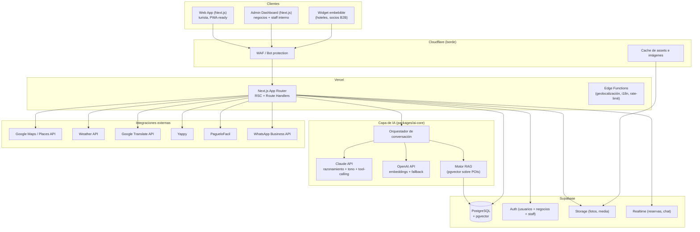

# 1. Arquitectura del Sistema

## Diagrama de alto nivel

## Principios de arquitectura

1. **El motor de IA es un módulo, no la app.** `packages/ai-core` no sabe renderizar UI ni depende
   de Next.js. Esto permite reutilizarlo en el widget B2B, en un futuro bot de WhatsApp, o en un
   canal de voz sin reescribir nada.
2. **La base de datos es la fuente de verdad de lo que la IA puede decir.** El orquestador nunca
   deja que el modelo mencione un lugar, precio u horario que no venga de una fila en `places`
   recuperada por RAG o tool-calling. Ver [`06-sistema-ia.md`](./06-sistema-ia.md).
3. **País como tenant, no como flag.** Cada tabla de dominio turístico tiene `country_id`. No hay
   `if (country === 'panama')` esparcido en el código de producto; hay configuración por país
   (moneda, idioma por defecto, zona horaria, tono cultural del concierge, integraciones locales)
   cargada desde la tabla `countries` y un paquete `packages/config`.
4. **Server-first, IA-stream-second.** Las páginas de contenido (perfil de lugar, colección,
   landing SEO por ciudad) se renderizan como React Server Components para SEO y velocidad. La
   experiencia conversacional es un cliente que hace streaming sobre Route Handlers — no hay
   necesidad de un backend separado para esto gracias a Vercel AI SDK sobre Next.js.
5. **RLS (Row Level Security) como perímetro de seguridad real**, no solo la capa de aplicación.
   Un negocio solo puede editar sus propias filas en `places` a nivel de base de datos, no solo
   porque el frontend se lo impide.

## Componentes de infraestructura

| Componente | Responsabilidad | Por qué esta elección |
|---|---|---|
| **Vercel** | Hosting Next.js, edge functions, preview deployments por PR | Cero-config con Next.js, despliegues por rama = QA de cada feature antes de mergear |
| **Supabase** | Postgres, Auth, Storage, Realtime, pgvector | Backend gestionado que no requiere equipo de DevOps para escalar hasta cientos de miles de usuarios; Postgres real (no un NoSQL propietario) evita vendor lock-in duro |
| **Cloudflare** | DNS, WAF, cache de imágenes/CDN, protección anti-bot | Protege contra scraping agresivo de nuestro dataset de POIs (el activo más valioso de la empresa) y contra abuso del endpoint de IA (costos de tokens) |
| **Upstash Redis** | Rate limiting, cache de respuestas de IA frecuentes, colas ligeras | Serverless, se integra nativo con Edge Functions de Vercel, sin servidores que mantener |
| **Yappy** | Pagos de reserva/checkout con usuarios y negocios que operan en el ecosistema de Banco General | El método de pago móvil más adoptado en Panamá — decisión explícita del negocio, no usamos Stripe |
| **PagueloFacil** | Suscripciones recurrentes de negocio, cobro a tarjeta de turista extranjero, ACH local | Pasarela panameña que cubre lo que Yappy no cubre: recurrencia y tarjeta internacional |
| **Sentry** | Error tracking (frontend + backend) | No estaba en la lista original pero es no-negociable para producción — se agrega en Fase 0 |
| **PostHog / Amplitude** | Analítica de producto y funnels | Necesario para medir la North Star Metric por país desde el día 1 |

## Multi-tenancy multipaís

- **Nivel de dominio**: `panama.visitai.com` (o dominio propio por país si el partnership lo
  exige, ej. `visitpanama.ai`), resuelto vía Cloudflare + middleware de Next.js que inyecta
  `country_id` en el contexto de request.
- **Nivel de datos**: toda tabla de dominio turístico (`places`, `events`, `categories`,
  `itineraries`, `businesses`) tiene `country_id UUID NOT NULL REFERENCES countries(id)`. Las
  políticas RLS filtran por país como primera cláusula.
- **Nivel de IA**: el system prompt del concierge se compone dinámicamente a partir de una
  plantilla base + un bloque de "personalidad y contexto cultural" por país almacenado en
  `countries.ai_persona_config` (jsonb). Lanzar un país nuevo no toca código de IA, solo datos.
- **Nivel de negocio**: planes, precios y moneda de suscripción están parametrizados por país en
  `country_pricing_config`, porque un plan Premium en Panamá y en México no deben tener el mismo
  precio en USD.

## Monorepo con Turborepo

Un solo repositorio para `web`, `admin`, `packages` compartidos. Razón: al tamaño de equipo de
una startup pre-Serie A, la fricción de sincronizar cambios entre repos (tipos de la base de
datos, componentes de UI, lógica de IA) cuesta más que el aislamiento que dan los microservicios.
Se revisita esta decisión solo si un equipo de +25 ingenieros empieza a pisarse en el mismo repo.

Ver el árbol completo en [`02-estructura-carpetas.md`](./02-estructura-carpetas.md).

## Repositorio

Este código vive hoy en `juankimoney`, que actualmente contiene un proyecto sin relación (una
tienda de moda de referencia). Recomendación: **crear un repositorio dedicado** (ej.
`panama-ai` o `visit-ai-platform`) en cuanto se apruebe esta arquitectura, y usar este repo/rama
solo para alojar la documentación de diseño hasta ese momento. Mezclar un e-commerce de moda y una
plataforma de turismo con IA en el mismo repo no tiene ninguna ventaja técnica y sí genera
confusión de CI/CD, variables de entorno y ownership.

## Entornos

| Entorno | Infraestructura | Propósito |
|---|---|---|
| **Local** | Supabase CLI (Postgres local en Docker), `.env.local` | Desarrollo diario |
| **Preview** | Vercel Preview Deployment + Supabase branch por PR | QA de cada Pull Request antes de mergear |
| **Staging** | Proyecto Supabase dedicado, dominio `staging.visitai.com` | Pruebas de integración, demo a stakeholders/inversionistas |
| **Producción** | Proyecto Supabase productivo, réplicas de lectura si el tráfico lo exige | Usuarios reales |

## Seguridad y cumplimiento (líneas base desde el MVP)

- RLS en todas las tablas sin excepción; ninguna tabla "abierta" por conveniencia de desarrollo.
- Secretos de API (Claude, OpenAI, Maps, Yappy, PagueloFacil) solo en variables de entorno de servidor, nunca
  expuestos al cliente; todo acceso a IA pasa por Route Handlers server-side.
- Rate limiting por IP y por usuario en el endpoint de chat (protege contra costos de tokens
  descontrolados).
- Cumplimiento con protección de datos personales aplicable (Panamá: Ley 81 de Protección de
  Datos Personales) desde el diseño del esquema de usuarios — minimización de datos, borrado de
  cuenta real, no solo "soft delete" cosmético.
