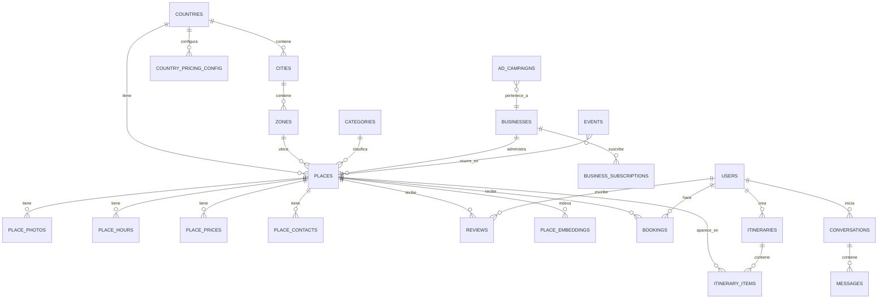

# 3. Base de Datos

PostgreSQL vía Supabase, con extensión **pgvector** para búsqueda semántica. Todo el esquema es
versionado en `supabase/migrations/`. RLS activo en el 100% de las tablas.

## Diagrama entidad-relación (núcleo)



## Tablas principales

### Geografía y taxonomía

```sql
-- countries: dimensión de tenant multipaís
countries (
  id uuid pk,
  code text unique,          -- 'PA', 'CR', 'CO'...
  name text,
  default_locale text,       -- 'es-PA'
  currency text,              -- 'USD'
  timezone text,
  ai_persona_config jsonb,    -- tono, referencias culturales, frases del concierge
  launched_at timestamptz,
  is_active boolean default false
)

cities (id uuid pk, country_id uuid fk, name text, slug text, geo point)

zones (id uuid pk, city_id uuid fk, name text, slug text, geo polygon)
-- ej: "Casco Antiguo", "Costa del Este", "Bocas del Toro"

categories (
  id uuid pk, parent_id uuid fk nullable, slug text, name jsonb, -- i18n: {"es": "...", "en": "..."}
  icon text, kind text -- 'restaurant' | 'hotel' | 'tour' | 'beach' | 'nightlife' | ...
)
```

### Negocios y lugares (el activo central)

```sql
businesses (
  id uuid pk, country_id uuid fk, owner_user_id uuid fk,
  legal_name text, contact_email text, verified boolean default false,
  created_at timestamptz
)

places (
  id uuid pk, country_id uuid fk, city_id uuid fk, zone_id uuid fk,
  business_id uuid fk nullable,   -- null = curado editorialmente, no reclamado por negocio
  category_id uuid fk,
  slug text unique,
  name text,
  description jsonb,              -- i18n
  price_level smallint,           -- 1-4 ($..$$$$)
  geo point not null,
  google_place_id text,           -- vínculo con Google Places para reviews/distancia
  status text default 'draft',    -- draft | published | archived
  featured_until timestamptz,     -- listado destacado (monetización)
  avg_rating numeric,
  review_count integer default 0,
  created_at timestamptz,
  updated_at timestamptz
)

place_photos (id uuid pk, place_id uuid fk, storage_path text, position smallint, alt_text jsonb)

place_hours (id uuid pk, place_id uuid fk, day_of_week smallint, opens_at time, closes_at time,
             is_closed boolean)

place_prices (id uuid pk, place_id uuid fk, label jsonb, amount numeric, currency text)

place_contacts (
  id uuid pk, place_id uuid fk,
  phone text, whatsapp text, instagram text, website text,
  booking_url text  -- para "botón de reservar" externo cuando no hay booking nativo
)

reviews (id uuid pk, place_id uuid fk, user_id uuid fk, rating smallint, body text,
         source text default 'internal', created_at timestamptz)
-- source: 'internal' | 'google_sync' — permite mostrar reseñas propias + de Google sin mezclarlas
```

### IA y personalización

```sql
-- embeddings para RAG semántico sobre lugares (ver 06-sistema-ia.md)
place_embeddings (
  place_id uuid pk fk,
  embedding vector(1536),   -- generado con text-embedding-3 de OpenAI
  content_hash text          -- para saber cuándo re-embeder tras una edición
)

conversations (id uuid pk, user_id uuid fk nullable, country_id uuid fk, locale text,
                started_at timestamptz, last_message_at timestamptz)
-- user_id nullable: se puede chatear sin cuenta; se asocia al crear cuenta

messages (id uuid pk, conversation_id uuid fk, role text, content text,
          tool_calls jsonb, created_at timestamptz)

user_preferences (
  user_id uuid pk fk, travel_style jsonb, -- {"budget": "mid", "kids": true, "pace": "relaxed"}
  favorite_categories uuid[], dietary_restrictions text[]
)

itineraries (id uuid pk, user_id uuid fk nullable, country_id uuid fk, title text,
             start_date date, end_date date, share_token text unique, created_at timestamptz)

itinerary_items (id uuid pk, itinerary_id uuid fk, place_id uuid fk, day smallint,
                  start_time time, position smallint, notes text)
```

### Transacciones y monetización

```sql
-- payment_provider: 'yappy' | 'paguelofacil' — ver 04-apis.md#pagos-yappy--paguelofacil.
-- Nunca se guarda información de tarjeta; solo la referencia que devuelve el proveedor.
bookings (id uuid pk, place_id uuid fk, user_id uuid fk, itinerary_item_id uuid fk nullable,
          status text, -- pending | confirmed | cancelled | completed
          party_size smallint, scheduled_for timestamptz,
          amount numeric, currency text,
          payment_provider text, payment_reference text, payment_status text,
          commission_amount numeric, created_at timestamptz)

business_plans (id uuid pk, country_id uuid fk, code text, -- 'free' | 'pro' | 'premium'
                 price_monthly numeric, currency text, features jsonb)

business_subscriptions (id uuid pk, business_id uuid fk, plan_id uuid fk,
                          payment_provider text, payment_reference text, status text,
                          current_period_end timestamptz)

ad_campaigns (id uuid pk, business_id uuid fk, place_id uuid fk nullable,
              placement text, -- 'itinerary_suggestion' | 'search_results' | 'category_banner'
              budget numeric, spent numeric, starts_at timestamptz, ends_at timestamptz,
              status text)

events (id uuid pk, country_id uuid fk, place_id uuid fk nullable, title jsonb,
        description jsonb, starts_at timestamptz, ends_at timestamptz,
        ticket_url text, is_free boolean)
```

### Identidad

```sql
-- users vive en auth.users (Supabase Auth); esta tabla extiende el perfil
profiles (id uuid pk references auth.users, role text default 'traveler',
          -- role: 'traveler' | 'business_owner' | 'staff' | 'admin'
          full_name text, avatar_url text, locale text, home_country text,
          created_at timestamptz)
```

## Row Level Security — patrón general

```sql
-- ejemplo: places
alter table places enable row level security;

create policy "lugares publicados son visibles por todos"
  on places for select
  using (status = 'published');

create policy "un negocio edita solo sus propios lugares"
  on places for update
  using (business_id in (
    select id from businesses where owner_user_id = auth.uid()
  ));

create policy "staff interno gestiona todo dentro de su país"
  on places for all
  using (
    exists (
      select 1 from profiles
      where profiles.id = auth.uid() and profiles.role in ('staff','admin')
    )
  );
```

Todas las tablas siguen este patrón: **lectura pública amplia para contenido publicado, escritura
restringida por ownership o rol**, evaluado en Postgres, no confiado al frontend.

## Búsqueda semántica (RAG)

`place_embeddings` se actualiza vía trigger/edge function cada vez que cambia `places` o
`place_prices`/`place_hours` relevantes. La consulta del concierge de IA hace:

```sql
select p.*, 1 - (pe.embedding <=> $1) as similarity
from places p
join place_embeddings pe on pe.place_id = p.id
where p.country_id = $2 and p.status = 'published'
order by pe.embedding <=> $1
limit 8;
```

Esto se combina con filtros estructurados (categoría, zona, precio, horario abierto ahora) antes
de pasarlo al modelo — ver [`06-sistema-ia.md`](./06-sistema-ia.md).

## Índices críticos desde el día 1

- `places (country_id, status)` — toda query pública filtra por esto.
- `places using gist (geo)` — búsquedas por cercanía ("la playa más cercana").
- `place_embeddings using ivfflat (embedding vector_cosine_ops)` — velocidad de RAG.
- `bookings (place_id, status)` y `bookings (user_id)`.

## Monetización

Las tablas `business_plans`, `business_subscriptions`, `ad_campaigns` y el campo
`places.featured_until` son el esqueleto de datos completo del modelo de negocio descrito en
[`overview.md`](./overview.md#modelo-de-negocio). Se crean desde el MVP aunque no se les ponga
UI de cobro hasta Fase 2 — es mucho más barato tener la columna vacía que migrarla después con
datos reales encima.
