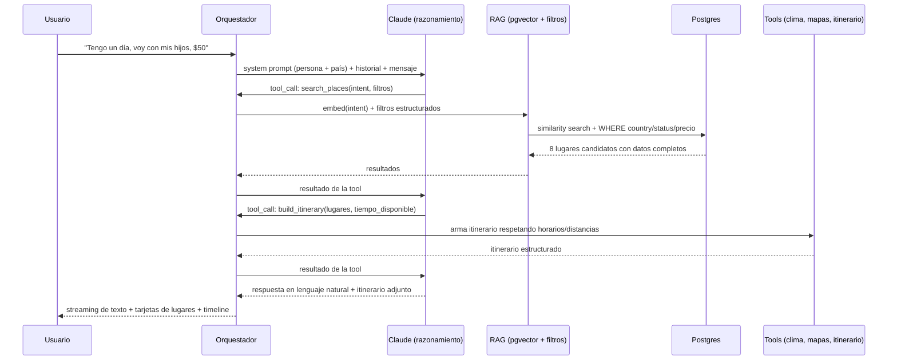

# 6. Sistema de Inteligencia Artificial

Este es el corazón del producto. Todo lo demás (base de datos, dashboard, pagos) existe para
alimentar o monetizar esto.

## Objetivo de diseño

El concierge debe **entender intención, no palabras clave**, sonar como un humano experto local
(no como un bot leyendo una FAQ), y **nunca recomendar algo que no exista de verdad** en nuestra
base de datos verificada. Estos tres objetivos determinan cada decisión de abajo.

## Arquitectura del motor (`packages/ai-core`)

## Por qué Claude como modelo principal de razonamiento

- **Seguimiento de instrucciones largas y matizadas de personalidad** (el system prompt del
  concierge —tono, límites, cómo manejar una emergencia— es largo y con muchas reglas
  condicionales; es exactamente el tipo de tarea donde Claude es consistentemente más confiable).
- **Tool-calling confiable con múltiples herramientas encadenadas** (buscar lugares → armar
  itinerario → verificar clima, en una sola conversación).
- **Menor tasa de alucinación cuando se le exige citar solo la información dada** — crítico
  porque el modelo tiene terminantemente prohibido inventar un restaurante.

**OpenAI** se usa para:
- **Embeddings** (`text-embedding-3-large/small`) para el índice `place_embeddings` — es el
  estándar de facto, barato, y desacoplar el proveedor de embeddings del proveedor de
  razonamiento es intencional (si un día cambia el modelo de razonamiento, no hay que
  re-embeder toda la base de datos).
- **Fallback de disponibilidad**: si la API de Claude tiene una interrupción, el orquestador
  puede degradar a GPT para no dejar el producto caído — con un system prompt equivalente
  probado contra el mismo golden set de evaluación (ver más abajo).

## El "cero alucinaciones" no es una promesa, es una restricción de arquitectura

El modelo **nunca** genera de memoria el nombre, precio, horario o dirección de un negocio. El
flujo obliga a que cualquier lugar mencionado en una respuesta haya venido de una tool call a
`search_places` en el turno actual o uno anterior de la misma conversación. El orquestador
post-procesa la respuesta del modelo: **si menciona un nombre propio de lugar que no está en el
set de resultados recuperado, la respuesta se descarta y se regenera** con una instrucción de
corrección explícita. Esto se prueba automáticamente en CI contra el golden set (abajo).

Para conocimiento general no transaccional (historia, cultura, gastronomía, "qué significa
Casco Viejo") el modelo sí puede usar su conocimiento de mundo — ahí el riesgo de una alucinación
es bajo impacto (no hay una acción de reserva de por medio) y el brief lo pide explícitamente
("explicar cultura", "explicar historia").

## Tools disponibles al modelo

| Tool | Qué hace |
|---|---|
| `search_places(intent, filters)` | RAG semántico + filtros estructurados (categoría, zona, precio, "abierto ahora", distancia al usuario) |
| `build_itinerary(place_ids[], time_budget, party)` | Ordena lugares por geografía y horarios en un timeline factible, evita rutas absurdas (dos lados opuestos de la ciudad en una tarde) |
| `modify_itinerary(itinerary_id, operation)` | Agregar/quitar/mover un ítem en un itinerario existente |
| `get_weather(city, when)` | Contexto climático para decidir indoor/outdoor |
| `get_place_availability(place_id, datetime, party_size)` | Consulta disponibilidad real antes de prometer una reserva |
| `create_booking(place_id, datetime, party_size)` | Ejecuta la reserva (requiere confirmación explícita del usuario, nunca se reserva sin que el usuario lo pida en texto claro) |
| `escalate_emergency(kind)` | Casos "perdí mi pasaporte" / "necesito un doctor" → responde con protocolo verificado (embajadas, líneas de emergencia, hospitales cercanos con datos reales de `places`), no con una respuesta genérica del modelo |
| `translate_context(text, target_locale)` | Uso interno cuando se necesita traducir contenido estructurado (no la conversación misma, que Claude traduce nativamente) |

## Detección de intención e idioma

No hay un clasificador de intención separado y frágil basado en keywords. **Claude clasifica la
intención como parte del mismo turno de razonamiento**, vía function calling — es más robusto
que un sistema de reglas para frases como "tengo hambre" (→ comida), "tengo $50" (→ restricción de
presupuesto, no una categoría), "tengo 5 horas" (→ restricción de tiempo). El idioma se detecta
por mensaje (no por sesión fija): un usuario puede escribir en inglés y cambiar a español a mitad
de conversación, y el concierge sigue el idioma del último mensaje.

## Persona: "Concierge Panama"

El system prompt base (en `packages/ai-core/src/prompts/base-persona.ts`) define un personaje
consistente: local, cálido pero eficiente, con opiniones (no una lista neutra de 10 opciones —
recomienda 2-3 con una razón concreta, como lo haría un concierge real), honesto sobre
limitaciones ("no tengo un lugar verificado que matchee eso, pero te puedo sugerir..."), y con
límites claros (no promete nada que no pueda cumplir vía tool, no da consejo médico/legal más
allá de derivar a un profesional real).

Cada país tiene un **override cultural** (`countries.ai_persona_config`) sobre esa base: modismos
locales aceptables, referencias culturales, y ejemplos de lugares icónicos para calibrar el tono
— no una personalidad distinta, la misma "voz de marca" con acento local.

## Memoria y contexto

- **Corto plazo**: historial completo de la conversación activa (`messages`), pasado al modelo en
  cada turno con una ventana razonable + resumen progresivo si la conversación es muy larga.
- **Largo plazo**: `user_preferences` (estilo de viaje, con niños, restricciones alimentarias)
  se actualiza de forma incremental cuando el usuario lo menciona explícitamente, y se inyecta en
  el system prompt de futuras conversaciones de un usuario con cuenta — así "tengo niños" dicho
  el día 1 no hay que repetirlo el día 3 del viaje.

## Guardrails y seguridad del contenido

- Prohibido recomendar negocios no verificados/no publicados (`status != 'published'`).
- Prohibido prometer precios/disponibilidad no confirmados por tool call en el turno.
- Detección de casos sensibles (salud, seguridad, documentos perdidos) enruta a
  `escalate_emergency`, que responde con información verificada y un tono apropiado, nunca con
  humor ni con la "personalidad cálida" por defecto.
- Los espacios patrocinados (`ad_campaigns`) se pueden inyectar como candidato adicional en
  `search_places`, pero **siempre marcados como "Patrocinado" en el dato que recibe el modelo**, y
  el system prompt exige que el modelo lo señale igual al usuario. Nunca se disfraza publicidad de
  recomendación orgánica — es una decisión de confianza de marca, no solo de compliance.

## Evaluación y mejora continua

- **Golden set** de ~150-300 prompts representativos (los ejemplos del brief: "tengo hambre",
  "tengo niños", "perdí mi pasaporte", en varios idiomas) corridos en CI contra cada cambio de
  prompt o de modelo, verificando: cero alucinación de lugares, tono correcto, tool-calling
  correcto.
- **Feedback loop de producto**: cada recomendación tiene un thumbs up/down; el negativo con
  comentario se revisa semanalmente y alimenta ajustes de prompt o de datos (si el problema es
  que falta un lugar en la categoría, es un problema de datos, no de IA).
- **Costos**: el orquestador cachea agresivamente respuestas a preguntas de conocimiento general
  repetidas (historia/cultura) y limita la profundidad de tool-calling por turno para controlar
  el costo de tokens por conversación — métrica vigilada desde el MVP porque escala con usuarios
  activos, no con revenue linealmente hasta que la monetización esté activa (Fase 2+).
