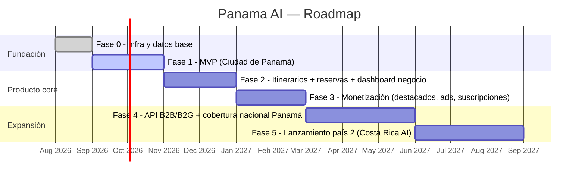

# 8. Roadmap

Roadmap a nivel de producto/negocio. La ejecución técnica fase por fase está en
[`10-fases-desarrollo.md`](./10-fases-desarrollo.md); este documento responde "qué y cuándo",
no "cómo se construye".

## Horizonte de 18 meses

## Hitos por trimestre

**T3 2026 — Fundación.** Infraestructura, esquema de datos, motor de IA con guardrails
funcionando sobre un dataset curado a mano de ~150-300 lugares de Ciudad de Panamá y Casco
Antiguo. Meta: un turista real puede completar un itinerario de un día sin ayuda humana.

**T4 2026 — Producto core.** Reservas nativas (al menos para tours/experiencias, que no dependen
de sistemas de reserva hotelera complejos), dashboard de negocio self-service, expansión de
dataset a Bocas del Toro, Boquete, Coronado. Meta: negocios empiezan a reclamar y mantener sus
propios perfiles sin intervención del equipo interno.

**T1 2027 — Monetización.** Listados destacados, planes de suscripción de negocio, primeras
campañas publicitarias nativas. Meta: primer dólar de revenue recurrente, validar disposición de
pago de negocios antes de levantar una ronda basada en esa métrica.

**T2-T3 2027 — Cobertura nacional + defensibilidad institucional.** API B2B lista para el primer
partner hotelero, primeras conversaciones con municipios/ATP (Autoridad de Turismo de Panamá) y
Tocumen para la API B2G. Meta: al menos un partnership institucional firmado — esto es lo que
distingue "app de turismo" de "infraestructura turística nacional" ante inversionistas.

**T3-T4 2027 — País 2.** Con el motor y el modelo de negocio validados en Panamá, replicar en
Costa Rica: nuevo dataset, ajuste de persona cultural, sin tocar arquitectura core. Meta: medir
cuánto más rápido y barato es el país 2 que el país 1 — ese delta es la métrica que se lleva a
una ronda Serie A.

## Métricas que gatillan cada fase (no calendario ciego)

No se avanza de fase solo porque pasó el tiempo. Criterios de salida concretos por fase están en
[`10-fases-desarrollo.md`](./10-fases-desarrollo.md#criterios-de-salida-por-fase). Ejemplo: no se
invierte en Fase 3 (monetización) hasta que la Fase 2 muestre retención semana 4 saludable — cobrar
antes de retener es cómo se mata un producto de turismo antes de tiempo.

## Narrativa de fundraising

- **Pre-seed / Angel (ahora → Fase 1)**: "el problema es real, el enfoque de IA+datos verificados
  es defendible, aquí está el prototipo funcionando en Ciudad de Panamá."
- **Seed (post Fase 2-3)**: "tenemos retención, negocios pagando, y el motor ya está desacoplado
  de Panamá — aquí está el plan de país 2."
- **Serie A (post Fase 5)**: "dos países en producción, al menos un partnership institucional, el
  costo marginal de lanzar el país 3 es una fracción del costo del país 1 — esto es
  infraestructura de turismo regional, no una app."
