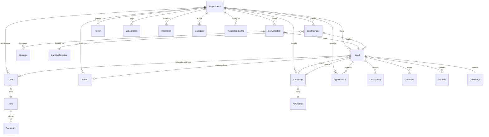

# Base de datos

Postgres + Prisma. Esquema completo en
[`packages/db/prisma/schema.prisma`](../packages/db/prisma/schema.prisma) —
este documento explica las decisiones, no repite cada columna.

## Diagrama de entidades (alto nivel)

## Entidades clave y por qué existen

- **`Organization`** — la clínica (tenant). Guarda plan de suscripción,
  especialidad principal (`ClinicSpecialty`: cirugía plástica, odontología,
  dermatología, medicina estética, ginecología, ortopedia, otro), ciudad
  (Panamá inicialmente, campo abierto para expansión LATAM), y config de IA
  (`aiProvider`, `aiModel` por defecto).
- **`User` + `Role` + `Permission`** — RBAC. `Role` es un enum fijo
  (`SUPER_ADMIN`, `ADMIN`, `MANAGER`, `RECEPTION`, `DOCTOR`, `MARKETING`,
  `SALES`, `CLIENT`) mapeado a un set de `Permission` en
  `packages/config/src/roles.ts` — no se modela como tabla editable en el MVP
  porque los 7 roles del brief son fijos y auditables; se documenta como
  mejora futura si se necesitan roles custom por clínica.
- **`Lead`** — el núcleo del CRM. Campos: datos de contacto, `source`
  (orgánico, Google Ads, Meta Ads, TikTok, referido, WhatsApp directo),
  `campaignId` opcional, `stage` (FK a `CRMStage`, ver `docs/CRM.md`),
  `assignedToId` (vendedor), `score` (calificación de IA 0-100),
  `estimatedValue` (para calcular pipeline $), timestamps de cada transición
  de estado (para calcular tiempo-por-etapa en reportes).
- **`LeadActivity`** — historial inmutable tipo event-log (creado, contactado,
  cambio de estado, llamada, mensaje enviado, nota, archivo). Es lo que
  alimenta el timeline en la ficha del lead y las automatizaciones basadas en
  "X pasó".
- **`Patient`** — un `Lead` que llegó a `PACIENTE`. Se modela como entidad
  separada (no solo un estado) porque un paciente real acumula datos clínicos
  mínimos (próxima cita, procedimiento, valor de por vida) que no tiene
  sentido cargar en cada lead. Nunca se guarda información clínica sensible
  (diagnósticos, historia médica) — ver `docs/RISKS.md` #1, la plataforma es
  de marketing/CRM, no un EHR.
- **`Appointment`** — citas, con estado (`AGENDADA`, `CONFIRMADA`,
  `REALIZADA`, `CANCELADA`, `NO_SHOW`) y canal de origen (IA por WhatsApp,
  manual, landing). Alimenta el embudo "consultas agendadas / realizadas /
  canceladas" del dashboard.
- **`Campaign`** — una campaña de ads (Meta/Google/TikTok) o iniciativa SEO,
  con `costTotal` (sincronizado por integración o manual) para calcular CPL
  (costo por lead) y CAC (costo por paciente) por campaña.
- **`Conversation` + `Message`** — bandeja unificada. `channel` enum
  (`WHATSAPP`, `INSTAGRAM`, `FACEBOOK`, `EMAIL`, `WEB_CHAT`). `Message.sender`
  distingue `LEAD`, `AI_ASSISTANT`, `HUMAN_AGENT` — necesario para
  reportar cuántas conversaciones resolvió la IA vs. un humano.
- **`AIAssistantConfig`** — por organización: qué proveedor/modelo usar por
  caso de uso (calificación, respuesta WhatsApp, generación de reportes),
  prompts custom, y flags de qué tareas tiene permitido automatizar
  (auto-agendar, auto-responder FAQ, etc.) — control fino para que la clínica
  decida cuánta autonomía le da a la IA.
- **`LandingPage` + `LandingTemplate`** — plantillas versionadas por
  especialidad; una `LandingPage` es una instancia (contenido + tema) de una
  plantilla, publicada bajo un slug.
- **`Report`** — snapshot mensual generado (JSON con métricas + URL del PDF en
  R2), para no tener que recalcular históricos si cambia la lógica de cálculo
  más adelante.
- **`Subscription` + `Invoice`** — reflejo de Stripe (customerId,
  subscriptionId, plan, estado) — Stripe es la fuente de verdad, esto es
  cache local para queries rápidas y para render de `/billing` sin llamar a
  Stripe en cada request.
- **`Integration`** — conexiones externas (HubSpot, Meta Ads, Google Ads,
  WhatsApp Business, Slack) con tokens cifrados y estado de salud —  modelo
  genérico (`provider` enum + `credentials` JSON cifrado) para no crear una
  tabla nueva por cada integración futura.
- **`AuditLog`** — quién hizo qué, cuándo, sobre qué recurso. Requisito de
  seguridad (`docs/RISKS.md` #6) y también da trazabilidad para soporte.

## Multi-tenancy

Toda tabla operativa tiene `organizationId String` con índice compuesto
`@@index([organizationId, ...])` en las columnas de filtro más comunes
(`stage`, `createdAt`, `assignedToId`). Sin esto, un dashboard con miles de
clínicas y millones de leads degrada rápido — se diseña el índice desde el
schema inicial en vez de agregarlo como parche.
