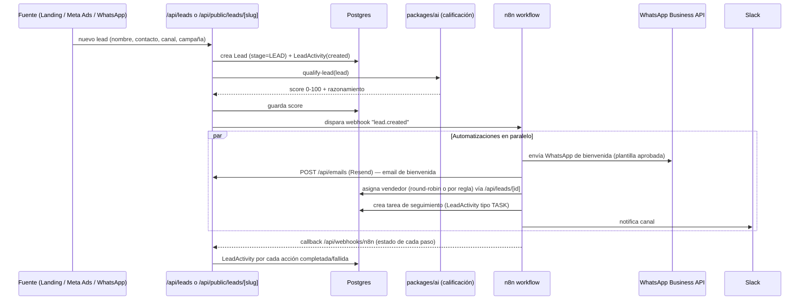
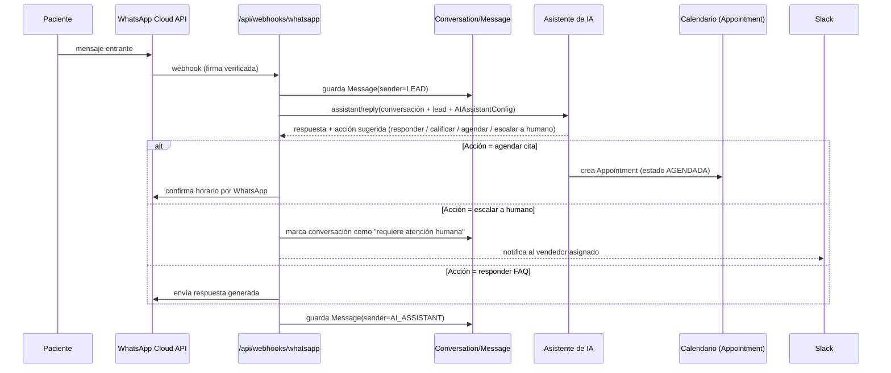
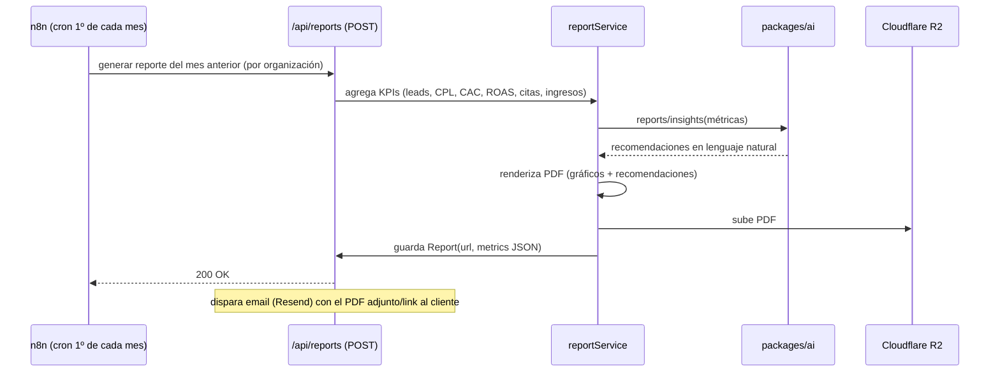

# Flujos principales

## 1. Entrada de un lead nuevo (el flujo más importante del negocio)



**Por qué pasa por n8n y no está todo hardcodeado en el API route:** las
reglas de "a quién se asigna", "qué plantilla de WhatsApp se usa según
especialidad", y "si Slack está conectado" cambian por clínica y por
temporada. Encapsular eso en un workflow visual permite que operaciones
ajuste sin deploy, mientras el API route solo garantiza que el `Lead` se creó
de forma consistente y auditable.

## 2. Conversación de WhatsApp → calificación → cita agendada



Reglas de negocio explícitas (no dejadas al modelo): el asistente **nunca**
promete precios exactos ni hace diagnósticos — responde con rangos/políticas
configuradas por la clínica y siempre puede escalar a un humano. Ver
`docs/AI_SYSTEM.md` y `docs/RISKS.md` #2 (publicidad médica regulada).

## 3. Ciclo de vida del embudo (CRM)

```
LEAD → CONTACTADO → CALIFICADO → COTIZACIÓN → CITA_AGENDADA → PACIENTE
                                                     ↘ NO_INTERESADO / PERDIDO (desde cualquier etapa)
```

Cada transición escribe `LeadActivity` con `fromStage`/`toStage` y quién/qué
la disparó (usuario humano o automatización), lo que permite calcular tiempo
promedio por etapa y tasa de conversión por etapa en el dashboard.

## 4. Reporte mensual automático



## 5. Auditoría de presencia digital

`POST /api/audit/run` dispara en paralelo: PageSpeed Insights (velocidad +
Core Web Vitals), un scraper ligero de metadatos SEO on-page, lectura de
Google Business Profile (rating, reseñas, completitud del perfil), e
Instagram/Facebook (métricas públicas básicas vía Graph API si la página está
conectada). Los resultados crudos se envían a `packages/ai` para producir un
resumen priorizado ("3 cosas que más te están costando pacientes este mes"),
y se renderiza a PDF vía el mismo pipeline que el reporte mensual.
