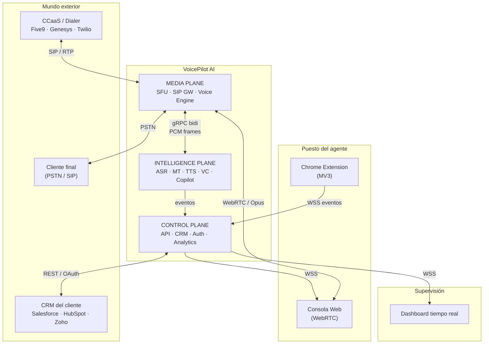
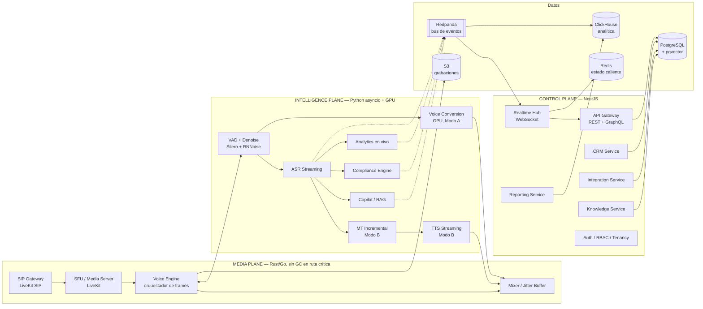

# 01 — Arquitectura del sistema

## 1. El principio que ordena todo: tres planos separados

El error clásico al construir esto es tratar el audio como "un feature más
del backend". El audio en tiempo real tiene requisitos incompatibles con una
API de negocio: no tolera pausas de GC, no tolera un redeploy, no tolera un
retry, no tolera una consulta a Postgres en el camino crítico.

Por eso el sistema está partido en **tres planos con SLAs distintos**:

| Plano | Latencia objetivo | Tolerancia a fallo | Lenguaje | Escala por |
|---|---|---|---|---|
| **Media Plane** | < 300 ms boca-a-oído | Ninguna. Un fallo = llamada muerta | Rust / Go / C++ | Llamadas concurrentes, GPU |
| **Intelligence Plane** | 100–900 ms | Degradable. Si falla, la llamada sigue | Python | Streams de IA concurrentes |
| **Control Plane** | 50–500 ms | Alta. Reintenta, encola, se recupera | TypeScript | Requests, usuarios |

**Regla de oro:** el Control Plane nunca está en el camino del audio.
Si Postgres se cae, las llamadas activas siguen sonando perfectas — solo se
dejan de guardar notas. Si el Intelligence Plane se cae, el audio pasa
**en crudo** (bypass) y el agente ve una alerta. El audio nunca se corta.

## 2. Vista de contexto



## 3. Arquitectura de componentes



## 4. Los servicios, uno por uno

### 4.1 Media Plane

| Servicio | Responsabilidad | Qué NO hace |
|---|---|---|
| **SIP Gateway** | Puente entre el troncal SIP del dialer y nuestro mundo WebRTC. Registro SIP, negociación de codecs, DTMF. | No decide nada de negocio |
| **SFU / Media Server** | Recibe/envía RTP. Enruta pistas de audio. Aísla al agente del cliente en pistas separadas. | No transcodifica IA |
| **Voice Engine** | El orquestador de frames. Decide, frame a frame, si el cliente escucha el audio original o el procesado. Maneja el crossfade, el bypass de emergencia y el jitter buffer de salida. | No habla con la base de datos |
| **Recorder** | Escribe las tres pistas (agente original, agente procesado, cliente) a S3 en Opus. Escritura asíncrona, fuera de la ruta crítica. | Nunca bloquea el audio |

El **Voice Engine** es el componente más crítico del sistema. Es el único
lugar donde una decisión de negocio ("¿modo A o B?", "¿bypass?") toca frames
de audio. Se escribe en **Rust**, se prueba con audio grabado, y tiene un
único invariante:

> **Siempre sale un frame de audio cada 20 ms hacia el cliente.
> Siempre. Aunque la IA entera esté caída.**

### 4.2 Intelligence Plane

| Servicio | Responsabilidad | Modelo/técnica | Latencia objetivo |
|---|---|---|---|
| **Audio Conditioner** | Denoise, AGC, supresión de voces de fondo, VAD | RNNoise + Silero VAD | < 10 ms |
| **Voice Conversion** | Modo A: acento/timbre latino → americano, frame-sincrónico | VC de streaming self-hosted, GPU | < 120 ms |
| **ASR** | Transcripción parcial + final, con diarización | Deepgram Nova streaming | 150–400 ms |
| **MT Incremental** | Modo B: ES→EN con política de commit | SimulST + revisión LLM | 300–600 ms |
| **TTS Streaming** | Modo B: texto → voz americana, TTFB mínimo | Cartesia / ElevenLabs Flash | 75–150 ms TTFB |
| **Copilot** | Sugerencia anclada al material de la empresa | RAG híbrido + LLM rápido | < 800 ms |
| **Compliance** | Detección de desvío del guion | Máquina de estados + clasificador | < 500 ms |
| **Live Analytics** | Sentimiento, estrés, intención | Clasificadores ligeros sobre texto + prosodia | < 1 s |
| **Post-call** | Resumen, notas, objeciones, próximos pasos | LLM de calidad, asíncrono | < 30 s |

Todos exponen **gRPC bidireccional streaming**. Ninguno expone HTTP en la
ruta caliente: el handshake HTTP por request es inaceptable a 50 frames/s.

### 4.3 Control Plane

| Servicio | Responsabilidad |
|---|---|
| **API Gateway** | REST público + GraphQL para el dashboard. Rate limiting, versionado, OpenAPI. |
| **Realtime Hub** | WebSocket hacia consola del agente, dashboard y extensión. Fan-out desde el bus. Presencia. |
| **Auth Service** | JWT de sesión corta + refresh, OAuth2, SAML/OIDC SSO, RBAC, aislamiento de tenant. |
| **CRM Service** | El CRM nativo: leads, contactos, pipeline, tareas, calendario, notas. |
| **Integration Service** | Conectores externos. OAuth, mapeo de campos, sincronía bidireccional, cola de reintentos, DLQ. |
| **Knowledge Service** | Ingesta de documentos, chunking, embeddings, versionado del corpus por tenant. |
| **Reporting Service** | Agregaciones, KPIs, ranking, exportaciones. Lee de ClickHouse, nunca de la OLTP. |
| **Billing Service** | Medición de minutos, cuotas, overage, facturación (Stripe). |

## 5. Flujo de datos de una llamada (resumen)

El detalle está en [doc 05](05-flujo-de-llamada.md). En una línea:

```
Dialer conecta → SIP GW crea sesión → Control Plane resuelve tenant,
agente, script, KB y modo de voz → Voice Engine abre streams gRPC →
audio fluye (procesado hacia el cliente, original al grabador) →
eventos de IA salen por el bus → UI del agente y dashboard se actualizan →
al colgar: pipeline post-llamada → escritura en CRM (nativo o externo)
```

## 6. Multi-tenancy

**Modelo: base de datos compartida, esquema compartido, `tenant_id` en toda
tabla, con Row-Level Security de PostgreSQL activo.**

Justificación: un modelo de DB-por-tenant es operacionalmente insostenible
con cientos de call centers pequeños, y prematuro. RLS a nivel de motor nos
da defensa en profundidad — aunque una query de la aplicación olvide el
`WHERE tenant_id`, Postgres lo bloquea.

```sql
-- Patrón aplicado a TODAS las tablas de negocio
ALTER TABLE leads ENABLE ROW LEVEL SECURITY;
CREATE POLICY tenant_isolation ON leads
  USING (tenant_id = current_setting('app.tenant_id')::uuid);
```

La aplicación fija `SET LOCAL app.tenant_id` al tomar la conexión del pool,
dentro de la transacción. Sin ese `SET`, las consultas devuelven cero filas —
falla cerrado, no abierto.

**Escape hatch enterprise:** clientes con requisito de aislamiento físico
(BPO regulados, salud, finanzas) obtienen despliegue dedicado con su propio
cluster y bucket. Es una configuración de Terraform, no un fork del código.

## 7. Estrategia de despliegue y regiones

La latencia de red no se optimiza: se **acorta geográficamente**.

```
Región del agente  ──WebRTC──►  Media Plane REGIONAL  ──►  GPU REGIONAL
   (Bogotá)                        (us-east-1 / sa-east-1)
                                          │
                                          ▼
                                  Control Plane GLOBAL
                                     (us-east-1)
```

- **Media Plane y GPU: regionales**, desplegados cerca del agente y del punto
  de interconexión PSTN. Un agente en Colombia y un cliente en Florida deben
  procesarse en `us-east-1`, no en `eu-west-1`.

  > **[MEDIDO — módulo 0.2a]** Esto no es una preferencia de rendimiento, es
  > una condición de existencia del producto. Con la GPU a 70 ms de ida, el
  > sistema entrega **0.00% de audio convertido**: cada frame llega pasado su
  > plazo y el cliente escucha la voz cruda del agente durante toda la llamada,
  > mientras todos los tableros reportan un enlace sano.
  >
  > Redimensionar el offset de playout a 330 ms restaura la entrega al 99.73%
  > — y sitúa la latencia boca-a-oído en **445 ms**, muy por encima de los
  > 300 ms prometidos. **No existe configuración que haga aceptable una GPU en
  > otra región.** O está colocada, o la promesa es otra.
  >
  > Reproducible: `cd media/voice-engine && cargo run --release --example remote-report`
- **Control Plane: global**, una región primaria con réplicas de lectura.
  Tolera 200 ms sin problema.
- **Datos: residencia por tenant.** Un tenant europeo fija su región de
  almacenamiento y sus grabaciones no salen de ahí.

## 8. Degradación: qué pasa cuando algo falla

Diseño explícito de fallos, en orden de gravedad:

| Falla | Comportamiento | Visible para el cliente final |
|---|---|---|
| Copilot caído | Panel muestra "sugerencias no disponibles" | No |
| Compliance caído | Se registra el hueco, alerta a supervisor | No |
| ASR caído | Sin transcripción; **Modo A sigue funcionando** (no depende de ASR) | No |
| Voice Conversion degradado (p95 > 400 ms) | Voice Engine hace **crossfade a audio original en 200 ms** y avisa al agente | Cambio de timbre, audible |
| GPU no disponible | Bypass inmediato, llamada continúa en crudo | Cambio de timbre |
| Control Plane caído | Llamadas activas siguen. No se pueden iniciar nuevas. Eventos se encolan. | No |
| Media Plane caído | La llamada cae. Es el único fallo fatal. | Sí |

**El bypass es una feature de primera clase, no un plan B.** Está en la ruta
de código principal, tiene su propio test de carga, y se ejercita en producción
con inyección de fallos semanal.

## 9. Observabilidad

Sin esto no se puede operar un sistema de tiempo real:

- **Trazas distribuidas (OpenTelemetry)** con `call_id` como trace ID. Una
  llamada = una traza, desde el SIP INVITE hasta la escritura en el CRM.
- **Métrica estrella: latencia boca-a-oído p50/p95/p99**, medida con marcas
  de tiempo inyectadas en el propio audio, no estimada por suma de etapas.
- **Presupuesto de error por etapa** del pipeline, alertando cuando una etapa
  se come más de su asignación (ver [doc 02](02-pipeline-voz-tiempo-real.md)).
- **MOS estimado** (calidad de audio percibida) por llamada, muestreado.
- **Sesiones reproducibles:** cada llamada puede re-simularse offline
  alimentando el audio grabado por el pipeline. Es la única forma de depurar
  un problema de audio que ocurrió hace tres días.

## 10. Lo que esta arquitectura deliberadamente NO hace

- **No usa una cola de mensajes en la ruta del audio.** Kafka/Redpanda es
  para eventos de negocio, no para frames. Un frame que llega tarde es basura,
  no un mensaje pendiente.
- **No usa microservicios finos en el Intelligence Plane.** ASR, VC, MT y TTS
  viven en **un solo proceso por llamada** cuando comparten GPU, para evitar
  copias de buffers entre procesos. La granularidad de despliegue no debe
  imponer costo de latencia.
- **No hace autoescalado reactivo del Media Plane.** Se pre-aprovisiona por
  pronóstico de turnos (los call centers tienen horarios rígidos y conocidos).
  Levantar un pod GPU tarda minutos; una llamada dura tres.
