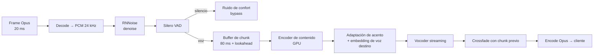

# 02 — Pipeline de voz en tiempo real

> Este es el documento más importante del proyecto. Todo lo demás es software
> de negocio que miles de equipos saben construir. Esto es lo que nos hace
> defendibles — y lo que puede matarnos.

---

## 1. La verdad incómoda, primero

Pediste **menos de 300 ms, palabra por palabra, sin esperar a que termine la
oración**, tanto para mejorar acento como para traducir.

- **Para el Modo A (inglés → inglés mejorado): sí. Es alcanzable, y este
  diseño lo alcanza.** Objetivo: **< 300 ms de latencia añadida**, p95.
- **Para el Modo B (español → inglés): no es posible. Ni para nosotros, ni
  para OpenAI, ni para nadie, hoy.** Objetivo honesto: **~900 ms**.

No es una limitación de ingeniería que se resuelva con mejor código o más
GPU. Es una propiedad del lenguaje. Vale la pena entender exactamente por
qué, porque de ahí sale toda la estrategia de producto.

### Por qué el Modo A sí puede

La conversión de acento es una transformación **frame-sincrónica**. El frame
de audio número 47 de salida depende del frame 47 de entrada y de un poco de
contexto pasado y futuro. No hay que reordenar nada. No hay que entender
nada. Se puede procesar en trozos de 40–80 ms y emitir continuamente. La
latencia es puramente computacional: lookahead del modelo + inferencia + red.

### Por qué el Modo B no puede

Traducir exige **entender**, y entender exige **esperar**.

Ejemplo real de una llamada de ventas:

> El agente dice: *"No, no le voy a cobrar nada..."*

Un traductor palabra-por-palabra a los 200 ms ya habría dicho *"No, I'm not
going to charge you"*. Pero la oración completa era:

> *"No, no le voy a cobrar nada **hasta que usted apruebe la orden**."*

La versión emitida temprano no está mal traducida: está **incompleta de una
forma que cambia la venta**. Y peor: una vez que la voz sintética ya dijo
"I'm not going to charge you", **no se puede retractar**. El audio ya salió.
No hay backspace en el oído del cliente.

Este es el problema fundamental de la traducción simultánea: **el
compromiso es irreversible**. Un sistema de texto puede revisar su
hipótesis; un sistema de voz que ya habló, no.

Los intérpretes humanos simultáneos de la ONU — los mejores del mundo en
esto — operan con un décalage de **2 a 4 segundos**. Nuestro objetivo de
~900 ms ya es agresivamente mejor que un profesional humano.

### La consecuencia de producto

**El Modo A es el producto. El Modo B es una capacidad de expansión.**

- Modo A se vende como: *"tu agente suena americano"* → 300 ms → invisible.
- Modo B se vende como: *"contrata gente que no habla inglés"* → 900 ms →
  se siente como una llamada satelital. Aceptable, pero perceptible.

Vender el Modo B como "sin delay" quema la credibilidad en la primera demo.
Vender el Modo B como *"acceso a un mercado laboral 5× más grande, a costa
de un pequeño retardo"* es una propuesta que se sostiene sola.

---

## 2. Presupuesto de latencia — Modo A

Medición **boca-a-oído**: desde que la onda sonora sale de la boca del agente
hasta que entra al oído del cliente. Es la única medida que importa.

### Línea base (sin VoicePilot)

Una llamada PSTN normal ya tiene **150–250 ms** de latencia. El oído humano
tolera hasta ~400 ms sin percibir incomodidad conversacional. Ese margen es
nuestro campo de juego.

### Presupuesto de latencia **añadida** por VoicePilot

| # | Etapa | Presupuesto | Notas |
|---|---|---|---|
| 1 | Captura + buffer del navegador | 20 ms | Frame Opus de 20 ms, WebAudio con `latencyHint: "interactive"` |
| 2 | Red agente → media edge | 25 ms | Requiere edge regional. Sin él, muere el presupuesto |
| 3 | Jitter buffer de entrada | 30 ms | Adaptativo, mínimo agresivo. El wifi malo es el enemigo |
| 4 | Acondicionamiento (denoise + VAD + AGC) | 10 ms | RNNoise + Silero, en CPU |
| 5 | **Lookahead del modelo de VC** | **80 ms** | El costo algorítmico irreducible. Ver §4 |
| 6 | **Inferencia de VC en GPU** | **35 ms** | Chunk de 80 ms sobre L4/A10G, batch=1 |
| 7 | Vocoder / síntesis de forma de onda | 15 ms | Incluido en modelos con vocoder integrado |
| 8 | Jitter buffer de salida + mezcla | 25 ms | Absorbe la varianza de la GPU |
| 9 | Red edge → gateway PSTN | 20 ms | Interconexión en el mismo datacenter idealmente |
| 10 | Transcodificación Opus → G.711 | 10 ms | Inevitable en PSTN |
| | **TOTAL AÑADIDO (p50)** | **270 ms** | |
| | **TOTAL AÑADIDO (p95)** | **~340 ms** | Con jitter y cola de GPU |

**Veredicto:** el objetivo de 300 ms se cumple en p50 y queda al filo en p95.
Las tres palancas para defenderlo:

1. **Edge regional obligatorio.** Un agente enrutado a la región equivocada
   añade 80–150 ms y revienta el presupuesto solo. El enrutamiento por
   geolocalización no es una optimización: es un requisito funcional.
2. **GPU dedicada, no compartida.** Batching dinámico entre llamadas ahorra
   costo pero introduce cola. La política es: **batch máximo 4, timeout de
   batch 10 ms**. Preferimos pagar más GPU que perder el p95.
3. **Lookahead configurable.** 80 ms es el punto dulce. Bajar a 40 ms
   degrada la naturalidad de la prosodia; subir a 160 ms mejora calidad pero
   nos saca del objetivo. Se expone como perilla por tenant.

---

## 3. Presupuesto de latencia — Modo B

| # | Etapa | Presupuesto | Notas |
|---|---|---|---|
| 1–4 | Captura → acondicionamiento | 85 ms | Igual que Modo A |
| 5 | **ASR: estabilización de hipótesis parcial** | **250 ms** | El ASR emite parciales a ~100 ms, pero solo confiamos en tokens estables |
| 6 | **Política de commit de traducción (wait-k)** | **300 ms** | Esperar k≈3 palabras antes de traducir. Ver §5 |
| 7 | Inferencia de MT incremental | 80 ms | Modelo de traducción simultánea dedicado |
| 8 | **TTS: time-to-first-byte** | **120 ms** | Modelos de streaming de baja latencia |
| 9 | Buffer de continuidad prosódica | 40 ms | Evita cortes entre chunks sintetizados |
| 10 | Jitter de salida + red + transcodificación | 55 ms | Igual que Modo A |
| | **TOTAL AÑADIDO (p50)** | **~930 ms** | |
| | **TOTAL AÑADIDO (p95)** | **~1,400 ms** | Frases largas y subordinadas pagan más |

### Cómo hacemos que ~930 ms se sienta bien y no roto

El problema no es el retardo en sí: es la **asimetría del turno de habla**.
El agente termina de hablar, y durante casi un segundo el cliente sigue
escuchando. Si el agente se calla y espera, ambos se quedan callados; si el
cliente empieza a hablar, se pisan.

Cuatro mecanismos de diseño resuelven esto:

1. **Retardo simétrico opcional.** El audio *entrante* del cliente se retrasa
   deliberadamente ~400 ms hacia el agente. Suena contraintuitivo, pero
   **iguala los tiempos de turno percibidos** para ambos lados y elimina el
   pisado. El agente se adapta en minutos; el cliente no percibe nada raro
   porque para él la conversación es coherente.
2. **Indicador visual de "cola de habla".** La consola del agente muestra una
   barra de cuántos milisegundos de su voz están todavía en vuelo. El agente
   aprende a no atropellar su propia traducción. Es el equivalente al
   monitor de un locutor de radio.
3. **Detección de barge-in del cliente.** Si el cliente empieza a hablar
   mientras hay traducción pendiente, el Voice Engine **acelera la reproducción
   pendiente un 8%** (imperceptible) y comprime silencios, en lugar de
   truncar la frase.
4. **Commit conservador, cero retractación.** Nunca emitimos audio de tokens
   no confirmados. Preferimos 200 ms más de retardo antes que una frase que
   contradice lo que el agente realmente dijo. **En ventas, una traducción
   retractada es una demanda.**

---

## 4. Modo A en detalle — Conversión de voz

### La decisión arquitectónica clave

Hay dos formas de convertir el acento de un agente:

| Enfoque | Cómo | Latencia | Riesgo |
|---|---|---|---|
| **Cascada** ASR → TTS | Transcribir, luego re-sintetizar el texto con voz americana | 500–900 ms | Pierde emoción, énfasis, risa, dudas. Suena a robot leyendo. Si el ASR falla, dice algo distinto a lo que el agente dijo |
| **Speech-to-Speech directo (VC)** | Modelo que transforma la forma de onda preservando contenido y prosodia | 120–200 ms | Requiere GPU e I+D propia |

**Elegimos Speech-to-Speech directo.** La cascada es la trampa en la que cae
todo el mundo porque es fácil de montar con APIs. Tiene dos defectos fatales:

1. **Latencia irrecuperable** — vuelve el Modo A tan lento como el Modo B,
   destruyendo la propuesta de valor.
2. **Riesgo de fidelidad** — si el ASR entiende "I can't do that" cuando el
   agente dijo "I can do that", el sistema le miente al cliente en nombre del
   agente. Es inaceptable en una llamada de ventas grabada.

La conversión directa preserva la intención: si el agente ríe, el cliente
escucha una risa; si duda, escucha una duda. Solo cambian el timbre y las
características fonéticas del acento.

### Pipeline del Modo A



### El bloque de I+D (riesgo técnico principal)

El modelo de conversión de voz es el activo defendible. Enfoque en tres pasos:

**Paso 1 — MVP:** modelo open-source de VC de streaming, afinado sobre un
corpus de acento latino→americano. Voces destino **licenciadas** de actores
de voz profesionales (nunca clonadas de terceros sin consentimiento).

**Paso 2 — Producción:** fine-tuning con el corpus propio que generan
nuestros propios clientes (con consentimiento contractual explícito y
anonimizado). Este es el volante de datos: cada llamada mejora el modelo.

**Paso 3 — Foso:** modelo propio entrenado sobre miles de horas de voz
latina real en condiciones de call center. Nadie más tendrá ese dataset.

**Requisito de calidad medible:**
- Similitud de locutor con la voz destino ≥ 0.80 (cosine, embeddings de
  verificación de locutor)
- WER de contenido preservado ≤ 5% (transcribir entrada y salida, comparar)
- MOS de naturalidad ≥ 4.0 en evaluación humana
- **Prueba de identidad:** que 20 receptores estadounidenses no identifiquen
  la voz como sintética en llamada ciega

### Selección de voz destino

Cada agente tiene asignada **una voz americana estable**. No rota. Razones:

- El cliente que devuelve la llamada debe reconocer al mismo agente
- La grabación debe ser consistente para QA y disputas legales
- Se registra en `agent_voice_profile` con auditoría de quién la asignó

La biblioteca ofrece variantes por género, edad percibida y región
(General American, Southern, Midwest) para calzar con la campaña.

---

## 5. Modo B en detalle — Traducción simultánea

### Política de commit (el corazón del Modo B)

Usamos **wait-k adaptativo**: no traducimos hasta tener k palabras de
contexto por delante del punto que vamos a emitir.

```
k dinámico basado en tres señales:
  - Estabilidad del token en el ASR (¿cambió en los últimos 3 parciales?)
  - Completitud sintáctica (¿hay verbo? ¿hay complemento pendiente?)
  - Detección de marcadores de negación/condición
    ("no ... hasta que", "solo si", "a menos que")

k mínimo = 2 palabras   (frases cortas y confirmaciones: "sí, claro")
k máximo = 7 palabras   (frases con subordinada condicional)
```

**Regla dura:** si se detecta un marcador de negación o condición pendiente,
**se bloquea el commit hasta resolver la cláusula**. Es preferible añadir
400 ms que traducir "no le voy a cobrar" sin su "hasta que".

### Continuidad prosódica

El TTS no se llama frase por frase (produciría un habla entrecortada, con
entonación reiniciada en cada trozo). Se mantiene **una sesión de síntesis
abierta por turno de habla**, alimentada incrementalmente, para que el modelo
mantenga la curva de entonación entre chunks.

### Fallback

Si la MT o el TTS fallan a mitad de una frase, el Voice Engine **no** vuelve
al audio original en español (el cliente escucharía español de golpe).
Reproduce el final de la frase en curso y emite silencio breve, mientras
la consola del agente muestra una alerta roja: *"traducción caída — pausa"*.

---

## 6. Capa 0 — Acondicionamiento de audio

**Este es el problema que subestima todo el mundo.** El modelo de voz más
avanzado del mundo produce basura si le entra el piso de un call center con
60 personas gritando.

| Problema | Solución | Dónde |
|---|---|---|
| Ruido de fondo estacionario | RNNoise / DeepFilterNet | CPU, 10 ms |
| Voces de compañeros (babble) | Extracción de locutor objetivo con embedding del agente registrado | GPU, 15 ms |
| Eco del altavoz | AEC en el navegador (WebRTC nativo) + AEC de servidor | Cliente |
| Nivel inconsistente | AGC con objetivo −18 dBFS | CPU |
| Clipping del micrófono | Detección + alerta al agente **antes** de la llamada | Pre-flight |

### Requisitos de hardware (contractuales, no sugerencias)

- **Diadema con micrófono de brazo y cancelación de ruido.** El audio de
  laptop no es aceptable y se rechaza en el pre-flight.
- Conexión con **jitter < 30 ms y pérdida < 1%**. Se mide continuamente.
- **Test de pre-vuelo obligatorio** al inicio de cada turno: mide ruido de
  fondo, nivel, jitter, y bloquea al agente si no pasa el umbral.

Ese pre-flight es también nuestro mejor escudo de soporte: cuando un cliente
reclame mala calidad, tendremos el registro exacto de las condiciones.

---

## 7. Protocolo interno de audio

Entre Voice Engine (Rust) y los servicios de IA (Python):

- **Transporte:** gRPC bidireccional streaming sobre HTTP/2, socket Unix
  cuando están en el mismo pod, TCP con `TCP_NODELAY` cuando no
- **Formato:** PCM float32, 24 kHz, mono, chunks de 20 ms
- **Cada chunk lleva:** `call_id`, `seq`, `capture_timestamp_ns`,
  `speaker` (agent/customer), flags de VAD
- **Backpressure:** si el consumidor de IA se retrasa más de 3 chunks, el
  Voice Engine **descarta y activa bypass**. No encola. Un buffer creciente
  en un sistema de tiempo real es una bomba de tiempo.
- **Marca de latencia:** el `capture_timestamp_ns` viaja con el audio hasta la
  salida, lo que permite medir latencia real punto a punto, no estimada

---

## 8. Plan de validación — Fase 0

Antes de escribir una línea del CRM, del dashboard o de la extensión, se
construye **únicamente esto** y se mide:

| Semana | Entregable | Criterio de salida |
|---|---|---|
| 1–2 | Banco de pruebas de latencia: audio grabado → pipeline → medición punto a punto | Instrumentación con precisión ±5 ms |
| 3–4 | Modo A extremo a extremo con VC open-source, una GPU | p95 boca-a-oído añadida < 400 ms |
| 5–6 | Fine-tuning de acento + evaluación de calidad | Similitud ≥ 0.75, WER ≤ 8% |
| 7 | Modo A sobre llamada PSTN real | p95 < 340 ms sostenido, 30 min |
| 8 | Prueba ciega con 20 receptores en EE.UU. | ≥ 8/10 no detectan síntesis |
| 9–10 | Modo B con wait-k adaptativo | p50 < 1,000 ms, cero retractaciones |
| 11–12 | Prueba de carga: 50 llamadas concurrentes por GPU | Sin degradación de p95 |

**Regla de decisión:** si en la semana 8 la prueba ciega falla, se detiene
todo el desarrollo de producto y se vuelve a I+D de voz. Construir el CRM
sobre un motor de voz que no convence es construir sobre arena.

---

## 9. Resumen de compromisos

| Compromiso | Valor | Confianza |
|---|---|---|
| Latencia añadida Modo A, p50 | 270 ms | Alta |
| Latencia añadida Modo A, p95 | 340 ms | Media — depende de edge regional y GPU dedicada |
| Latencia añadida Modo B, p50 | 930 ms | Media |
| Naturalidad Modo A (MOS) | ≥ 4.0 | Media — es el riesgo de I+D |
| Continuidad de audio ante fallo de IA | 100% | Alta — es una garantía arquitectónica |
| Cero retractaciones de traducción | 100% | Alta — es una decisión de política, no de modelo |
