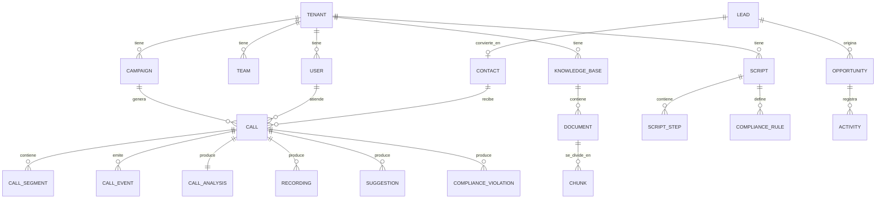

# 03 — Modelo de datos

## 1. Principios

1. **`tenant_id` en absolutamente toda tabla de negocio**, con Row-Level
   Security activo. Sin excepción, ni siquiera en tablas "obviamente
   internas".
2. **Modelo canónico único.** El CRM nativo y los conectores externos
   escriben contra las mismas entidades. Salesforce no tiene su propio
   esquema; tiene un *mapeo* al nuestro.
3. **Separación OLTP / OLAP.** PostgreSQL es la fuente de verdad
   transaccional. ClickHouse recibe los eventos para analítica. Ningún
   dashboard consulta la OLTP.
4. **Los datos de llamada son inmutables.** Transcripciones, segmentos y
   eventos se escriben una vez. Las correcciones se registran como nuevas
   filas con `supersedes_id`, nunca como `UPDATE`. Requisito de auditoría.
5. **Soft delete en entidades de negocio** (`deleted_at`), hard delete solo
   en flujos de derecho al olvido, y con registro en el log de auditoría.

## 2. Mapa de dominios



---

## 3. Dominio: Tenancy e identidad

```sql
CREATE TABLE tenants (
    id              UUID PRIMARY KEY DEFAULT gen_random_uuid(),
    slug            CITEXT UNIQUE NOT NULL,
    name            TEXT NOT NULL,
    crm_mode        TEXT NOT NULL CHECK (crm_mode IN ('native','integrated','hybrid')),
    data_region     TEXT NOT NULL DEFAULT 'us-east-1',
    plan            TEXT NOT NULL DEFAULT 'trial',
    settings        JSONB NOT NULL DEFAULT '{}',
    -- settings: { voice_defaults, ai_disclosure_mode, recording_policy,
    --             retention_days, allowed_domains, latency_profile }
    status          TEXT NOT NULL DEFAULT 'active',
    created_at      TIMESTAMPTZ NOT NULL DEFAULT now(),
    deleted_at      TIMESTAMPTZ
);

CREATE TABLE users (
    id              UUID PRIMARY KEY DEFAULT gen_random_uuid(),
    tenant_id       UUID NOT NULL REFERENCES tenants(id),
    email           CITEXT NOT NULL,
    full_name       TEXT NOT NULL,
    password_hash   TEXT,                -- NULL si es solo SSO
    sso_subject     TEXT,
    mfa_secret      TEXT,
    status          TEXT NOT NULL DEFAULT 'active',
    last_login_at   TIMESTAMPTZ,
    created_at      TIMESTAMPTZ NOT NULL DEFAULT now(),
    deleted_at      TIMESTAMPTZ,
    UNIQUE (tenant_id, email)
);

CREATE TABLE roles (
    id              UUID PRIMARY KEY DEFAULT gen_random_uuid(),
    tenant_id       UUID REFERENCES tenants(id),  -- NULL = rol de sistema
    key             TEXT NOT NULL,   -- agent, supervisor, qa, admin, owner, analyst
    name            TEXT NOT NULL,
    permissions     TEXT[] NOT NULL, -- ['call:listen','lead:write','report:export',...]
    is_system       BOOLEAN NOT NULL DEFAULT false,
    UNIQUE (tenant_id, key)
);

CREATE TABLE user_roles (
    user_id         UUID NOT NULL REFERENCES users(id) ON DELETE CASCADE,
    role_id         UUID NOT NULL REFERENCES roles(id),
    scope_type      TEXT,             -- NULL = todo el tenant, o 'team'
    scope_id        UUID,
    granted_by      UUID REFERENCES users(id),
    granted_at      TIMESTAMPTZ NOT NULL DEFAULT now(),
    PRIMARY KEY (user_id, role_id, COALESCE(scope_id, '00000000-0000-0000-0000-000000000000'))
);

CREATE TABLE teams (
    id              UUID PRIMARY KEY DEFAULT gen_random_uuid(),
    tenant_id       UUID NOT NULL REFERENCES tenants(id),
    name            TEXT NOT NULL,
    supervisor_id   UUID REFERENCES users(id),
    parent_team_id  UUID REFERENCES teams(id),
    created_at      TIMESTAMPTZ NOT NULL DEFAULT now()
);

CREATE TABLE team_members (
    team_id         UUID NOT NULL REFERENCES teams(id) ON DELETE CASCADE,
    user_id         UUID NOT NULL REFERENCES users(id) ON DELETE CASCADE,
    PRIMARY KEY (team_id, user_id)
);
```

### Perfil de voz del agente

```sql
CREATE TABLE agent_voice_profiles (
    id                  UUID PRIMARY KEY DEFAULT gen_random_uuid(),
    tenant_id           UUID NOT NULL REFERENCES tenants(id),
    user_id             UUID NOT NULL REFERENCES users(id),
    target_voice_id     TEXT NOT NULL,        -- id de voz licenciada
    default_mode        TEXT NOT NULL CHECK (default_mode IN ('A','B','off')),
    source_language     TEXT NOT NULL DEFAULT 'es-CO',
    speaker_embedding   BYTEA,                -- para extracción de locutor objetivo
    embedding_version   TEXT,
    consent_recorded_at TIMESTAMPTZ NOT NULL, -- consentimiento del agente
    assigned_by         UUID REFERENCES users(id),
    created_at          TIMESTAMPTZ NOT NULL DEFAULT now(),
    UNIQUE (tenant_id, user_id)
);
```

> `consent_recorded_at` es `NOT NULL` a propósito: **no se puede procesar la
> voz de un agente sin consentimiento registrado.** El esquema hace cumplir
> la política.

---

## 4. Dominio: CRM

> **Nota sobre el DDL de este documento.** Las tablas se presentan agrupadas
> por dominio para que se lean bien, no en orden de migración. Hay
> referencias hacia adelante (`leads.campaign_id` → `campaigns`). Las
> migraciones reales ordenan por dependencia o crean las claves foráneas en
> un paso posterior.

```sql
CREATE TABLE contacts (
    id              UUID PRIMARY KEY DEFAULT gen_random_uuid(),
    tenant_id       UUID NOT NULL REFERENCES tenants(id),
    first_name      TEXT,
    last_name       TEXT,
    company         TEXT,
    email           CITEXT,
    phone_e164      TEXT,
    timezone        TEXT,
    country         TEXT,
    do_not_call     BOOLEAN NOT NULL DEFAULT false,
    dnc_reason      TEXT,
    consent_flags   JSONB NOT NULL DEFAULT '{}',
    custom_fields   JSONB NOT NULL DEFAULT '{}',
    external_ids    JSONB NOT NULL DEFAULT '{}',  -- {"salesforce":"003...","hubspot":"12345"}
    created_at      TIMESTAMPTZ NOT NULL DEFAULT now(),
    updated_at      TIMESTAMPTZ NOT NULL DEFAULT now(),
    deleted_at      TIMESTAMPTZ
);
CREATE INDEX ON contacts (tenant_id, phone_e164) WHERE deleted_at IS NULL;
CREATE INDEX ON contacts USING GIN (external_ids jsonb_path_ops);

CREATE TABLE leads (
    id              UUID PRIMARY KEY DEFAULT gen_random_uuid(),
    tenant_id       UUID NOT NULL REFERENCES tenants(id),
    contact_id      UUID REFERENCES contacts(id),
    campaign_id     UUID REFERENCES campaigns(id),
    source          TEXT,
    status          TEXT NOT NULL DEFAULT 'new',
                    -- new, contacted, qualified, unqualified, converted, lost
    score           SMALLINT,
    ai_score        SMALLINT,          -- probabilidad de cierre calculada por IA
    owner_id        UUID REFERENCES users(id),
    disposition     TEXT,
    last_contacted_at TIMESTAMPTZ,
    next_action_at  TIMESTAMPTZ,
    custom_fields   JSONB NOT NULL DEFAULT '{}',
    external_ids    JSONB NOT NULL DEFAULT '{}',
    created_at      TIMESTAMPTZ NOT NULL DEFAULT now(),
    updated_at      TIMESTAMPTZ NOT NULL DEFAULT now(),
    deleted_at      TIMESTAMPTZ
);
CREATE INDEX ON leads (tenant_id, status, owner_id) WHERE deleted_at IS NULL;
CREATE INDEX ON leads (tenant_id, next_action_at) WHERE deleted_at IS NULL;

CREATE TABLE pipelines (
    id              UUID PRIMARY KEY DEFAULT gen_random_uuid(),
    tenant_id       UUID NOT NULL REFERENCES tenants(id),
    name            TEXT NOT NULL,
    is_default      BOOLEAN NOT NULL DEFAULT false
);

CREATE TABLE pipeline_stages (
    id              UUID PRIMARY KEY DEFAULT gen_random_uuid(),
    tenant_id       UUID NOT NULL REFERENCES tenants(id),
    pipeline_id     UUID NOT NULL REFERENCES pipelines(id) ON DELETE CASCADE,
    name            TEXT NOT NULL,
    position        SMALLINT NOT NULL,
    probability     SMALLINT NOT NULL DEFAULT 0,  -- 0-100
    is_won          BOOLEAN NOT NULL DEFAULT false,
    is_lost         BOOLEAN NOT NULL DEFAULT false,
    UNIQUE (pipeline_id, position)
);

CREATE TABLE opportunities (
    id              UUID PRIMARY KEY DEFAULT gen_random_uuid(),
    tenant_id       UUID NOT NULL REFERENCES tenants(id),
    lead_id         UUID REFERENCES leads(id),
    contact_id      UUID REFERENCES contacts(id),
    pipeline_id     UUID NOT NULL REFERENCES pipelines(id),
    stage_id        UUID NOT NULL REFERENCES pipeline_stages(id),
    name            TEXT NOT NULL,
    amount_cents    BIGINT,
    currency        CHAR(3) NOT NULL DEFAULT 'USD',
    owner_id        UUID REFERENCES users(id),
    expected_close_date DATE,
    closed_at       TIMESTAMPTZ,
    close_reason    TEXT,
    ai_close_probability NUMERIC(4,3),
    custom_fields   JSONB NOT NULL DEFAULT '{}',
    external_ids    JSONB NOT NULL DEFAULT '{}',
    created_at      TIMESTAMPTZ NOT NULL DEFAULT now(),
    updated_at      TIMESTAMPTZ NOT NULL DEFAULT now(),
    deleted_at      TIMESTAMPTZ
);

CREATE TABLE stage_transitions (
    id              BIGSERIAL PRIMARY KEY,
    tenant_id       UUID NOT NULL,
    opportunity_id  UUID NOT NULL REFERENCES opportunities(id),
    from_stage_id   UUID REFERENCES pipeline_stages(id),
    to_stage_id     UUID NOT NULL REFERENCES pipeline_stages(id),
    changed_by      UUID REFERENCES users(id),
    call_id         UUID,           -- si la movió una llamada
    occurred_at     TIMESTAMPTZ NOT NULL DEFAULT now()
);

CREATE TABLE notes (
    id              UUID PRIMARY KEY DEFAULT gen_random_uuid(),
    tenant_id       UUID NOT NULL REFERENCES tenants(id),
    entity_type     TEXT NOT NULL,   -- lead, contact, opportunity, call
    entity_id       UUID NOT NULL,
    body            TEXT NOT NULL,
    author_id       UUID REFERENCES users(id),
    source          TEXT NOT NULL DEFAULT 'human',  -- human | ai_post_call
    ai_metadata     JSONB,           -- modelo, versión, confianza
    created_at      TIMESTAMPTZ NOT NULL DEFAULT now(),
    deleted_at      TIMESTAMPTZ
);
CREATE INDEX ON notes (tenant_id, entity_type, entity_id);

CREATE TABLE tasks (
    id              UUID PRIMARY KEY DEFAULT gen_random_uuid(),
    tenant_id       UUID NOT NULL REFERENCES tenants(id),
    title           TEXT NOT NULL,
    description     TEXT,
    entity_type     TEXT,
    entity_id       UUID,
    assignee_id     UUID REFERENCES users(id),
    due_at          TIMESTAMPTZ,
    priority        TEXT NOT NULL DEFAULT 'normal',
    status          TEXT NOT NULL DEFAULT 'open',
    source          TEXT NOT NULL DEFAULT 'human',  -- human | ai_post_call
    completed_at    TIMESTAMPTZ,
    created_at      TIMESTAMPTZ NOT NULL DEFAULT now()
);

CREATE TABLE calendar_events (
    id              UUID PRIMARY KEY DEFAULT gen_random_uuid(),
    tenant_id       UUID NOT NULL REFERENCES tenants(id),
    title           TEXT NOT NULL,
    starts_at       TIMESTAMPTZ NOT NULL,
    ends_at         TIMESTAMPTZ NOT NULL,
    timezone        TEXT NOT NULL,
    organizer_id    UUID REFERENCES users(id),
    entity_type     TEXT,
    entity_id       UUID,
    external_calendar_id TEXT,       -- Google/Outlook
    external_event_id    TEXT,
    created_at      TIMESTAMPTZ NOT NULL DEFAULT now()
);

CREATE TABLE campaigns (
    id              UUID PRIMARY KEY DEFAULT gen_random_uuid(),
    tenant_id       UUID NOT NULL REFERENCES tenants(id),
    name            TEXT NOT NULL,
    client_name     TEXT,
    script_id       UUID,
    knowledge_base_id UUID,
    voice_mode      TEXT NOT NULL DEFAULT 'A',
    target_market   TEXT,             -- 'US', 'US-CA', ...
    status          TEXT NOT NULL DEFAULT 'active',
    starts_on       DATE,
    ends_on         DATE,
    created_at      TIMESTAMPTZ NOT NULL DEFAULT now()
);
```

---

## 5. Dominio: Llamadas

```sql
CREATE TABLE calls (
    id                  UUID PRIMARY KEY DEFAULT gen_random_uuid(),
    tenant_id           UUID NOT NULL REFERENCES tenants(id),
    campaign_id         UUID REFERENCES campaigns(id),
    agent_id            UUID NOT NULL REFERENCES users(id),
    contact_id          UUID REFERENCES contacts(id),
    lead_id             UUID REFERENCES leads(id),

    direction           TEXT NOT NULL CHECK (direction IN ('inbound','outbound')),
    from_e164           TEXT,
    to_e164             TEXT,

    provider            TEXT,          -- twilio, five9, genesys, native
    provider_call_id    TEXT,
    sip_call_id         TEXT,

    voice_mode          TEXT NOT NULL, -- A, B, off
    target_voice_id     TEXT,

    status              TEXT NOT NULL, -- ringing, active, on_hold, completed, failed, abandoned
    disposition         TEXT,
    hangup_cause        TEXT,

    started_at          TIMESTAMPTZ NOT NULL,
    answered_at         TIMESTAMPTZ,
    ended_at            TIMESTAMPTZ,
    duration_ms         INTEGER,
    talk_time_ms        INTEGER,

    -- métricas de calidad, la razón por la que existe esta columna
    latency_p50_ms      SMALLINT,
    latency_p95_ms      SMALLINT,
    bypass_ms           INTEGER NOT NULL DEFAULT 0,  -- tiempo en audio crudo
    audio_mos           NUMERIC(3,2),
    packet_loss_pct     NUMERIC(5,2),

    created_at          TIMESTAMPTZ NOT NULL DEFAULT now()
) PARTITION BY RANGE (started_at);

-- Particionado mensual: una llamada es un registro de alta cardinalidad
-- y retención acotada. Purga por DROP PARTITION, no por DELETE.
CREATE INDEX ON calls (tenant_id, started_at DESC);
CREATE INDEX ON calls (tenant_id, agent_id, started_at DESC);
CREATE INDEX ON calls (tenant_id, contact_id);

CREATE TABLE call_segments (
    id                  BIGSERIAL,
    tenant_id           UUID NOT NULL,
    call_id             UUID NOT NULL,
    seq                 INTEGER NOT NULL,
    speaker             TEXT NOT NULL CHECK (speaker IN ('agent','customer','system')),
    start_ms            INTEGER NOT NULL,
    end_ms              INTEGER NOT NULL,

    text_original       TEXT NOT NULL,    -- lo que realmente se dijo
    language_original   TEXT NOT NULL,
    text_delivered      TEXT,             -- lo que el cliente escuchó (Modo B)
    is_final            BOOLEAN NOT NULL DEFAULT true,
    confidence          NUMERIC(4,3),
    supersedes_id       BIGINT,           -- corrección, nunca UPDATE

    created_at          TIMESTAMPTZ NOT NULL DEFAULT now(),
    PRIMARY KEY (call_id, seq, id)
) PARTITION BY HASH (call_id);

CREATE INDEX ON call_segments (tenant_id, call_id, start_ms);
-- Búsqueda de texto completo sobre transcripciones
CREATE INDEX ON call_segments USING GIN (to_tsvector('english', text_original));

CREATE TABLE call_events (
    id                  BIGSERIAL PRIMARY KEY,
    tenant_id           UUID NOT NULL,
    call_id             UUID NOT NULL,
    at_ms               INTEGER NOT NULL,
    type                TEXT NOT NULL,
    -- voice_mode_changed, bypass_started, bypass_ended, hold, transfer,
    -- dtmf, sentiment_shift, objection_detected, compliance_alert,
    -- suggestion_shown, suggestion_used, supervisor_joined, ...
    payload             JSONB NOT NULL DEFAULT '{}',
    created_at          TIMESTAMPTZ NOT NULL DEFAULT now()
);
CREATE INDEX ON call_events (call_id, at_ms);

CREATE TABLE recordings (
    id                  UUID PRIMARY KEY DEFAULT gen_random_uuid(),
    tenant_id           UUID NOT NULL,
    call_id             UUID NOT NULL,
    track               TEXT NOT NULL CHECK (track IN ('agent_raw','agent_processed','customer','mixed')),
    storage_uri         TEXT NOT NULL,
    codec               TEXT NOT NULL DEFAULT 'opus',
    duration_ms         INTEGER,
    size_bytes          BIGINT,
    sha256              TEXT,
    encryption_key_id   TEXT NOT NULL,
    expires_at          TIMESTAMPTZ,     -- retención por política del tenant
    created_at          TIMESTAMPTZ NOT NULL DEFAULT now()
);
```

> **Nota de diseño:** guardamos `agent_raw` **y** `agent_processed`. La pista
> cruda es la prueba legal de lo que el agente realmente dijo; la procesada
> es lo que el cliente escuchó. En cualquier disputa, ambas son necesarias.
> `text_original` y `text_delivered` cumplen la misma función en texto.

### Análisis de llamada

```sql
CREATE TABLE call_analysis (
    call_id             UUID PRIMARY KEY,
    tenant_id           UUID NOT NULL,

    summary             TEXT,
    key_points          JSONB,            -- ["...", "..."]
    objections          JSONB,            -- [{type, quote, at_ms, handled:bool}]
    next_steps          JSONB,
    products_discussed  JSONB,
    competitors_mentioned JSONB,

    sentiment_overall   NUMERIC(4,3),     -- -1.0 .. 1.0
    sentiment_timeline  JSONB,            -- [{at_ms, value}]
    customer_stress     NUMERIC(4,3),
    customer_interest   NUMERIC(4,3),
    agent_confidence    NUMERIC(4,3),
    close_probability   NUMERIC(4,3),

    talk_ratio          NUMERIC(4,3),     -- agente / total
    longest_monologue_ms INTEGER,
    interruptions_count SMALLINT,
    silence_pct         NUMERIC(4,3),

    script_adherence    NUMERIC(4,3),
    qa_score            NUMERIC(5,2),

    model_version       TEXT NOT NULL,
    generated_at        TIMESTAMPTZ NOT NULL DEFAULT now()
);
```

---

## 6. Dominio: Conocimiento (RAG)

```sql
CREATE TABLE knowledge_bases (
    id              UUID PRIMARY KEY DEFAULT gen_random_uuid(),
    tenant_id       UUID NOT NULL REFERENCES tenants(id),
    name            TEXT NOT NULL,
    description     TEXT,
    active_version  INTEGER NOT NULL DEFAULT 1,
    created_at      TIMESTAMPTZ NOT NULL DEFAULT now()
);

CREATE TABLE documents (
    id              UUID PRIMARY KEY DEFAULT gen_random_uuid(),
    tenant_id       UUID NOT NULL,
    knowledge_base_id UUID NOT NULL REFERENCES knowledge_bases(id),
    kb_version      INTEGER NOT NULL,
    title           TEXT NOT NULL,
    doc_type        TEXT NOT NULL,   -- script, manual, policy, faq, product, objection, training
    source_type     TEXT NOT NULL,   -- pdf, docx, txt, html, url, manual
    source_uri      TEXT,
    storage_uri     TEXT,
    sha256          TEXT,
    page_count      INTEGER,
    status          TEXT NOT NULL DEFAULT 'pending',
                    -- pending, extracting, chunking, embedding, ready, failed
    error           TEXT,
    uploaded_by     UUID REFERENCES users(id),
    created_at      TIMESTAMPTZ NOT NULL DEFAULT now()
);

CREATE TABLE chunks (
    id              UUID PRIMARY KEY DEFAULT gen_random_uuid(),
    tenant_id       UUID NOT NULL,
    document_id     UUID NOT NULL REFERENCES documents(id) ON DELETE CASCADE,
    knowledge_base_id UUID NOT NULL,
    kb_version      INTEGER NOT NULL,
    seq             INTEGER NOT NULL,
    content         TEXT NOT NULL,
    heading_path    TEXT,             -- "Objeciones > Precio > Muy caro"
    page_number     INTEGER,
    token_count     SMALLINT,
    embedding       VECTOR(1024),
    tsv             TSVECTOR GENERATED ALWAYS AS (to_tsvector('english', content)) STORED,
    metadata        JSONB NOT NULL DEFAULT '{}'
);

-- Búsqueda híbrida: vectorial + léxica
CREATE INDEX ON chunks USING hnsw (embedding vector_cosine_ops)
    WITH (m = 16, ef_construction = 64);
CREATE INDEX ON chunks USING GIN (tsv);
CREATE INDEX ON chunks (tenant_id, knowledge_base_id, kb_version);
```

> **Versionado del corpus (`kb_version`):** cuando el cliente sube un script
> nuevo, no se sobrescribe. Se crea una versión. Las llamadas antiguas siguen
> auditables contra el material que estaba vigente *ese día*. Esto es
> obligatorio para defenderse en una disputa de compliance.

---

## 7. Dominio: Scripts y compliance

```sql
CREATE TABLE scripts (
    id              UUID PRIMARY KEY DEFAULT gen_random_uuid(),
    tenant_id       UUID NOT NULL,
    name            TEXT NOT NULL,
    version         INTEGER NOT NULL DEFAULT 1,
    knowledge_base_id UUID REFERENCES knowledge_bases(id),
    status          TEXT NOT NULL DEFAULT 'draft',  -- draft, active, archived
    created_at      TIMESTAMPTZ NOT NULL DEFAULT now(),
    UNIQUE (tenant_id, name, version)
);

CREATE TABLE script_steps (
    id              UUID PRIMARY KEY DEFAULT gen_random_uuid(),
    tenant_id       UUID NOT NULL,
    script_id       UUID NOT NULL REFERENCES scripts(id) ON DELETE CASCADE,
    position        SMALLINT NOT NULL,
    key             TEXT NOT NULL,       -- greeting, identity_verification, pitch, ...
    name            TEXT NOT NULL,
    required        BOOLEAN NOT NULL DEFAULT false,
    expected_text   TEXT,
    detection       JSONB NOT NULL,
    -- { mode: 'keyword'|'semantic'|'both',
    --   keywords: [...], semantic_prompt: '...', threshold: 0.8 }
    must_occur_before_ms INTEGER,        -- ej. verificar identidad < 60000
    UNIQUE (script_id, position)
);

CREATE TABLE compliance_rules (
    id              UUID PRIMARY KEY DEFAULT gen_random_uuid(),
    tenant_id       UUID NOT NULL,
    script_id       UUID REFERENCES scripts(id),
    key             TEXT NOT NULL,
    name            TEXT NOT NULL,
    rule_type       TEXT NOT NULL CHECK (rule_type IN ('must_say','must_not_say','must_say_before','conditional')),
    severity        TEXT NOT NULL CHECK (severity IN ('info','warning','critical')),
    detection       JSONB NOT NULL,
    alert_text      TEXT NOT NULL,       -- "⚠ Debes verificar identidad"
    jurisdictions   TEXT[],              -- ['US-CA','US-FL'] o NULL = todas
    active          BOOLEAN NOT NULL DEFAULT true
);

CREATE TABLE compliance_violations (
    id              BIGSERIAL PRIMARY KEY,
    tenant_id       UUID NOT NULL,
    call_id         UUID NOT NULL,
    rule_id         UUID NOT NULL REFERENCES compliance_rules(id),
    at_ms           INTEGER NOT NULL,
    severity        TEXT NOT NULL,
    evidence_text   TEXT,
    evidence_segment_id BIGINT,
    detection_method TEXT NOT NULL,      -- deterministic | classifier | both
    confidence      NUMERIC(4,3),
    agent_acknowledged BOOLEAN NOT NULL DEFAULT false,
    resolved_at     TIMESTAMPTZ,
    resolved_by     UUID REFERENCES users(id),
    created_at      TIMESTAMPTZ NOT NULL DEFAULT now()
);
CREATE INDEX ON compliance_violations (tenant_id, created_at DESC, severity);
```

---

## 8. Dominio: Copilot

```sql
CREATE TABLE suggestions (
    id              BIGSERIAL PRIMARY KEY,
    tenant_id       UUID NOT NULL,
    call_id         UUID NOT NULL,
    at_ms           INTEGER NOT NULL,
    trigger_type    TEXT NOT NULL,   -- objection, question, silence, keyword, stage_change
    trigger_text    TEXT NOT NULL,   -- lo que dijo el cliente
    suggestion_text TEXT NOT NULL,
    citations       JSONB NOT NULL,  -- [{chunk_id, document_id, page, score}]
    grounding_score NUMERIC(4,3) NOT NULL,
    model_version   TEXT NOT NULL,
    latency_ms      SMALLINT,
    shown           BOOLEAN NOT NULL DEFAULT false,
    used            BOOLEAN NOT NULL DEFAULT false,   -- ¿el agente lo dijo?
    used_similarity NUMERIC(4,3),
    feedback        SMALLINT,        -- -1, 0, 1 del agente
    created_at      TIMESTAMPTZ NOT NULL DEFAULT now()
);
```

> `citations` y `grounding_score` son **NOT NULL** por diseño. Una sugerencia
> sin cita no puede existir en la base de datos. La regla de "cero
> alucinaciones" está impuesta por el esquema, no solo por el prompt.
>
> `used` + `used_similarity` cierran el bucle: sabemos qué sugerencias
> realmente usa el agente y cuáles ignora. Es la señal de entrenamiento más
> valiosa del producto.

---

## 9. Dominio: Integraciones

```sql
CREATE TABLE crm_connections (
    id                  UUID PRIMARY KEY DEFAULT gen_random_uuid(),
    tenant_id           UUID NOT NULL REFERENCES tenants(id),
    provider            TEXT NOT NULL,   -- salesforce, hubspot, zoho, zendesk, ...
    display_name        TEXT,
    auth_type           TEXT NOT NULL,   -- oauth2, api_key, basic
    credentials_ref     TEXT NOT NULL,   -- referencia al secret manager, NUNCA el secreto
    instance_url        TEXT,
    scopes              TEXT[],
    status              TEXT NOT NULL DEFAULT 'active',
    last_sync_at        TIMESTAMPTZ,
    last_error          TEXT,
    created_at          TIMESTAMPTZ NOT NULL DEFAULT now(),
    UNIQUE (tenant_id, provider, instance_url)
);

CREATE TABLE field_mappings (
    id                  UUID PRIMARY KEY DEFAULT gen_random_uuid(),
    tenant_id           UUID NOT NULL,
    connection_id       UUID NOT NULL REFERENCES crm_connections(id) ON DELETE CASCADE,
    canonical_entity    TEXT NOT NULL,   -- lead, contact, opportunity, call, note
    canonical_field     TEXT NOT NULL,
    external_object     TEXT NOT NULL,
    external_field      TEXT NOT NULL,
    direction           TEXT NOT NULL CHECK (direction IN ('push','pull','both')),
    transform           JSONB            -- {type:'enum_map', map:{...}}
);

CREATE TABLE sync_state (
    id                  BIGSERIAL PRIMARY KEY,
    tenant_id           UUID NOT NULL,
    connection_id       UUID NOT NULL REFERENCES crm_connections(id),
    entity_type         TEXT NOT NULL,
    cursor              TEXT,
    last_full_sync_at   TIMESTAMPTZ,
    last_delta_sync_at  TIMESTAMPTZ,
    UNIQUE (connection_id, entity_type)
);

CREATE TABLE sync_operations (
    id                  BIGSERIAL PRIMARY KEY,
    tenant_id           UUID NOT NULL,
    connection_id       UUID NOT NULL,
    direction           TEXT NOT NULL,
    entity_type         TEXT NOT NULL,
    internal_id         UUID,
    external_id         TEXT,
    operation           TEXT NOT NULL,   -- create, update, delete
    status              TEXT NOT NULL,   -- pending, succeeded, failed, dead
    attempts            SMALLINT NOT NULL DEFAULT 0,
    next_attempt_at     TIMESTAMPTZ,
    idempotency_key     TEXT NOT NULL,
    request_payload     JSONB,
    error               TEXT,
    created_at          TIMESTAMPTZ NOT NULL DEFAULT now(),
    UNIQUE (connection_id, idempotency_key)
);
CREATE INDEX ON sync_operations (status, next_attempt_at) WHERE status = 'pending';
```

---

## 10. Auditoría y seguridad

```sql
CREATE TABLE audit_log (
    id              BIGSERIAL PRIMARY KEY,
    tenant_id       UUID NOT NULL,
    actor_type      TEXT NOT NULL,   -- user, system, integration, ai
    actor_id        UUID,
    action          TEXT NOT NULL,   -- call.listen, recording.download, lead.export, ...
    entity_type     TEXT,
    entity_id       UUID,
    ip_address      INET,
    user_agent      TEXT,
    before          JSONB,
    after           JSONB,
    request_id      TEXT,
    occurred_at     TIMESTAMPTZ NOT NULL DEFAULT now()
) PARTITION BY RANGE (occurred_at);
CREATE INDEX ON audit_log (tenant_id, occurred_at DESC);
CREATE INDEX ON audit_log (tenant_id, actor_id, occurred_at DESC);

CREATE TABLE api_keys (
    id              UUID PRIMARY KEY DEFAULT gen_random_uuid(),
    tenant_id       UUID NOT NULL,
    name            TEXT NOT NULL,
    key_prefix      TEXT NOT NULL,   -- vp_live_a1b2 — visible
    key_hash        TEXT NOT NULL,   -- argon2 del resto
    scopes          TEXT[] NOT NULL,
    created_by      UUID REFERENCES users(id),
    last_used_at    TIMESTAMPTZ,
    expires_at      TIMESTAMPTZ,
    revoked_at      TIMESTAMPTZ
);
```

---

## 11. Capa analítica (ClickHouse)

PostgreSQL no es para dashboards de tiempo real sobre millones de llamadas.
El bus de eventos alimenta ClickHouse con tablas desnormalizadas:

```sql
-- ClickHouse
CREATE TABLE call_facts (
    tenant_id           UUID,
    call_id             UUID,
    agent_id            UUID,
    team_id             UUID,
    campaign_id         UUID,
    started_at          DateTime64(3),
    date                Date MATERIALIZED toDate(started_at),
    duration_ms         UInt32,
    talk_time_ms        UInt32,
    voice_mode          LowCardinality(String),
    disposition         LowCardinality(String),
    converted           UInt8,
    revenue_cents       Int64,
    sentiment_overall   Float32,
    close_probability   Float32,
    script_adherence    Float32,
    compliance_critical UInt8,
    suggestions_shown   UInt16,
    suggestions_used    UInt16,
    latency_p95_ms      UInt16,
    bypass_ms           UInt32
) ENGINE = MergeTree
ORDER BY (tenant_id, date, agent_id, started_at);

CREATE TABLE sentiment_timeseries (
    tenant_id  UUID, call_id UUID, at_ms UInt32,
    sentiment Float32, stress Float32, interest Float32
) ENGINE = MergeTree ORDER BY (tenant_id, call_id, at_ms);
```

Vistas materializadas precalculan KPIs por agente/equipo/campaña/día, que es
lo que el dashboard consulta. Ninguna consulta del dashboard toca Postgres.

---

## 12. Retención de datos

| Dato | Retención por defecto | Configurable | Motivo |
|---|---|---|---|
| Grabaciones de audio | 90 días | 30 d – 7 años | Costo de almacenamiento y exposición legal |
| Transcripciones | 2 años | sí | Barato, valioso para QA |
| Análisis de llamada | 2 años | sí | Alimenta reportes históricos |
| Eventos de llamada | 90 días | sí | Alto volumen |
| Log de auditoría | 7 años | no (mínimo legal) | Requisito de cumplimiento |
| Embeddings / chunks | Mientras exista la KB | — | — |
| Datos de contacto | Hasta borrado / derecho al olvido | sí | GDPR / CCPA |

La purga corre como job diario: `DROP PARTITION` para tablas particionadas,
ciclo de vida de objetos en S3 para audio.
