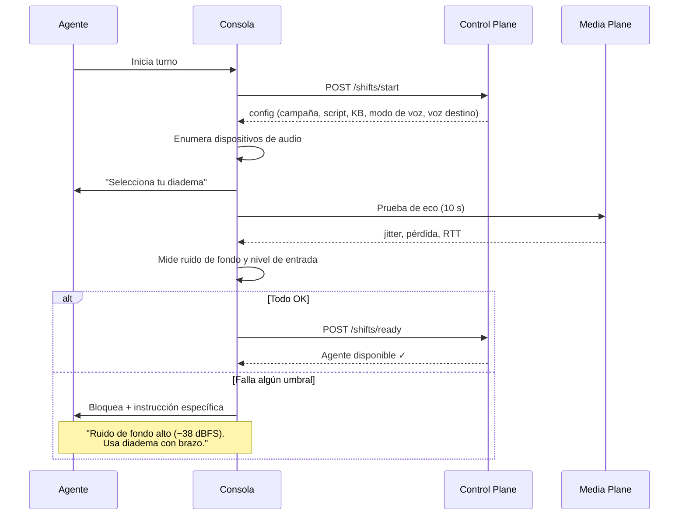
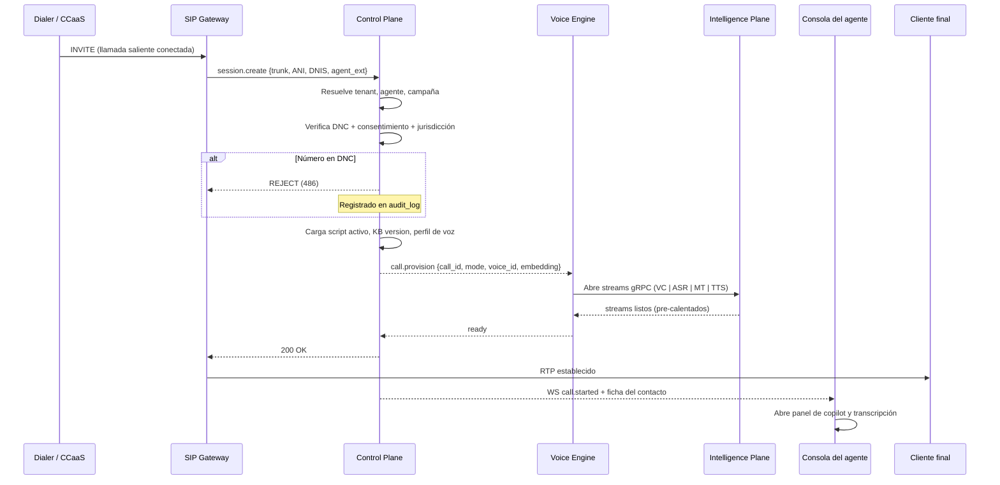
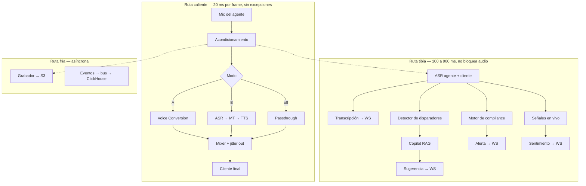
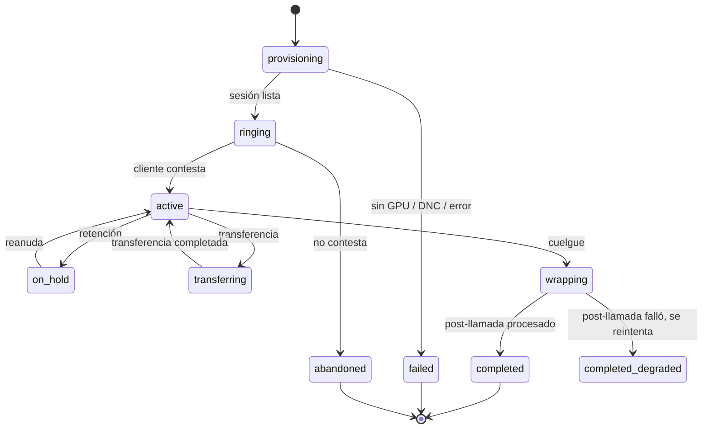
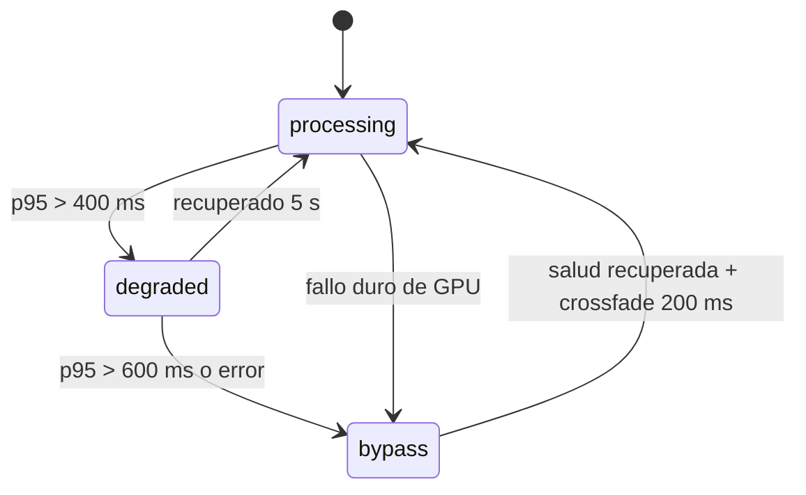
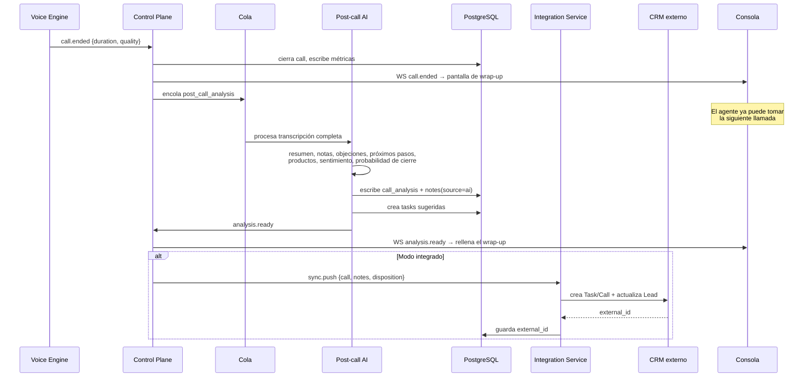

# 05 — Flujo de llamada

## 1. Antes de la llamada: el pre-vuelo

Sin esto, el 40% de los tickets de soporte serán "se escucha mal" sin
posibilidad de diagnóstico. El pre-vuelo corre **al inicio de cada turno**,
no una vez al instalar.



### Umbrales de bloqueo

| Métrica | Umbral | Acción si falla |
|---|---|---|
| Ruido de fondo | > −45 dBFS | Advertencia; > −35 dBFS → bloqueo |
| Nivel de voz | fuera de −24…−12 dBFS | Guía de ajuste de ganancia |
| Jitter de red | > 30 ms | Advertencia; > 60 ms → bloqueo |
| Pérdida de paquetes | > 1% | Advertencia; > 3% → bloqueo |
| RTT al edge | > 80 ms | Advertencia + verificar región |
| Dispositivo | altavoz de laptop | **Bloqueo duro** |
| Eco detectado | AEC no converge | Bloqueo |

Cada ejecución se guarda. Cuando el cliente reclame calidad, tendremos el
histórico exacto de las condiciones de cada agente.

---

## 2. Establecimiento de la llamada



### El detalle que decide la latencia: pre-calentamiento

Abrir un stream de GPU, cargar el embedding de voz y calentar el modelo tarda
**300–900 ms**. Si eso ocurre cuando el cliente ya contestó, las primeras
palabras del agente — las más importantes de toda la llamada — salen en
crudo o cortadas.

**Solución:** el Voice Engine mantiene un **pool de sesiones pre-calentadas**
por agente activo. Cuando el dialer marca, la sesión ya existe. El costo es
GPU ociosa; el beneficio es que el saludo suena perfecto. Se paga.

```
Agente entra a turno → se reserva 1 sesión caliente
Llamada conectada    → se adopta la sesión, se reserva otra
Llamada termina      → sesión se recicla (reset de estado, no de modelo)
```

---

## 3. Durante la llamada



### Las tres rutas y su regla de oro

| Ruta | Latencia | Regla |
|---|---|---|
| **Caliente** | 20 ms/frame | Nada la bloquea. Ni logs síncronos, ni DB, ni asignaciones de memoria en el loop |
| **Tibia** | 0.1–1 s | Puede fallar. Si falla, la llamada continúa y el agente ve el aviso |
| **Fría** | segundos–minutos | Puede reintentar. Nada la espera |

### Qué ve el agente en pantalla

```
┌──────────────────────────────────────────────────────────────────┐
│  Michael Reed · +1 305 555 0142 · Miami FL      ⏱ 06:52          │
│  Campaña: Solar Q3   ·   🎙 Modo A · 287 ms ✓                    │
├────────────────────────────┬─────────────────────────────────────┤
│  TRANSCRIPCIÓN             │  COPILOT                            │
│                            │                                     │
│  Cliente  06:41            │  ⚡ Objeción: PRECIO                 │
│  "that's more than I       │                                     │
│   wanted to spend"         │  "I hear you — and that's exactly   │
│                            │   why we split it over 24 months    │
│  Tú  06:45                 │   with no interest. Your monthly    │
│  "I completely understand" │   would actually drop below what    │
│                            │   you pay the utility today."       │
│  ▌ escuchando…             │                                     │
│                            │  📄 Objection Handling v4, pág. 7   │
│                            │  ────────────────────────────────   │
│                            │  ⚠ COMPLIANCE                       │
│                            │  Falta mencionar el descuento       │
│                            │  federal antes de cerrar            │
├────────────────────────────┴─────────────────────────────────────┤
│  Sentimiento ▁▂▃▅▄▃▂  −0.31   Interés 22%   Cierre 34%           │
└──────────────────────────────────────────────────────────────────┘
```

Tres reglas de diseño de esta pantalla, aprendidas de por qué fracasan los
copilotos de call center:

1. **Máximo una sugerencia visible.** Un agente hablando no puede leer tres
   opciones. Se muestra la mejor o ninguna.
2. **La cita siempre visible.** El agente debe poder confiar en que eso está
   en el manual. Sin la cita, no lo dirá.
3. **El indicador de latencia es permanente.** Si el sistema se degrada, el
   agente lo sabe antes que el cliente lo note, y puede desacelerar su habla.

---

## 4. Máquina de estados de la llamada



### Sub-estados del pipeline de voz (ortogonales)



El cambio `processing → bypass` **nunca es abrupto**: hay un crossfade de
200 ms entre la voz procesada y la original. Un corte seco de timbre es más
sospechoso para el cliente que el cambio gradual.

---

## 5. Al colgar: el pipeline post-llamada



### El punto de diseño más importante del post-llamada

**El agente no espera al análisis.** La pantalla de wrap-up aparece
instantáneamente con los campos vacíos y un indicador de "generando…". El
agente puede pasar a la siguiente llamada de inmediato; cuando el análisis
termina (~15–25 s), se rellena solo.

Si el agente ya cerró la pantalla, el análisis se guarda igual. **Nunca se
pierde trabajo por velocidad del agente.**

### Qué se genera automáticamente

| Campo | Fuente | Requiere revisión humana |
|---|---|---|
| Resumen (3–5 líneas) | LLM sobre transcripción | No |
| Notas estructuradas | LLM + plantilla del tenant | No |
| Disposición sugerida | Clasificador sobre taxonomía del tenant | **Sí** — el agente confirma |
| Objeciones detectadas | Clasificador + citas de la transcripción | No |
| Próximos pasos | LLM | No |
| Tareas de seguimiento | LLM → `tasks` con `source='ai_post_call'` | **Sí** — el agente acepta o descarta |
| Productos mencionados | Extracción anclada al catálogo del tenant | No |
| Probabilidad de cierre | Modelo entrenado con histórico del tenant | No |
| Movimiento de etapa | **Nunca automático** | **Sí, siempre** |

> **Nunca movemos una oportunidad de etapa automáticamente.** Es la acción de
> mayor impacto en el forecast y en la comisión del agente. La IA propone; el
> humano dispone. Un forecast contaminado por IA destruye la confianza en todo
> el producto de un golpe.

---

## 6. Casos especiales

### Transferencia entre agentes

La sesión de voz **no se hereda**. El agente B tiene su propia voz destino y
su propio perfil. Al transferir:
1. Se provisiona una sesión nueva para B (ya está caliente, del pool)
2. La transcripción y el contexto de la llamada se traspasan íntegros
3. El copilot de B arranca con el resumen de lo que ya pasó
4. Se registra `call_event: transfer` con ambos `agent_id`

### Llamada en tres vías / supervisor

El supervisor entra en `listen` (solo escucha), `whisper` (habla solo con el
agente) o `barge` (habla con todos). En modo `whisper`, **el audio del
supervisor nunca pasa por el mixer de salida al cliente** — es un camino
físicamente separado en el Voice Engine, no una bandera. Un bug de bandera
que envíe el susurro del supervisor al cliente sería catastrófico.

### El cliente pide hablar con un supervisor "americano"

Escenario real e incómodo. Política del producto: el supervisor tiene su
propio perfil de voz y el modo se aplica igual. El sistema no miente sobre
nacionalidad — solo procesa audio. La política de divulgación es del tenant
(ver [doc 09](09-seguridad-y-compliance.md)).

### Reconexión del agente

Si la consola del agente se cae (crash del navegador, wifi), **la llamada
sigue viva** — el audio va por WebRTC al media server, que es quien la
sostiene. La consola reconecta y reanuda desde el último `seq`. La llamada
solo cae si el ICE de WebRTC no se restablece en 15 s.

### DTMF y pausas de PCI

Si el agente pide un número de tarjeta, el tenant puede activar **pausa PCI**:
- El agente presiona "Pausa segura"
- La grabación se detiene (se marca el hueco en el registro)
- El ASR se detiene
- El audio sigue pasando por conversión de voz sin ningún registro
- Al reanudar, todo vuelve, y el hueco queda auditado

Esto es requisito duro para cualquier campaña que toque pagos.
