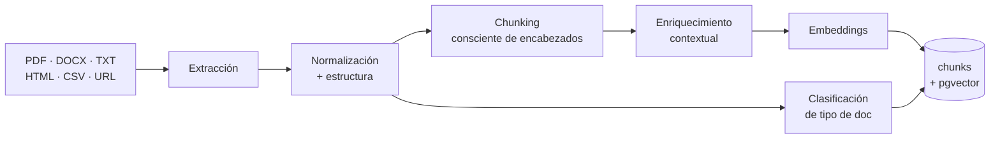
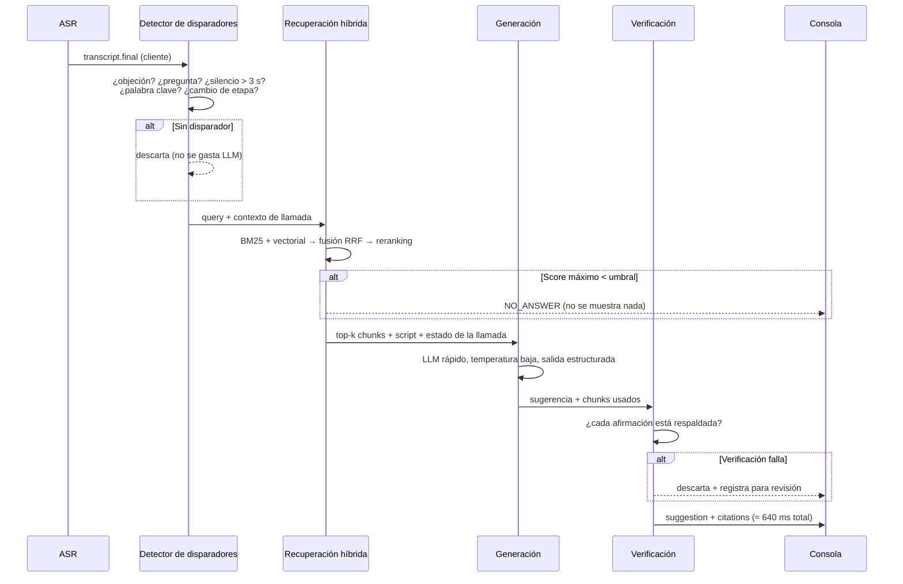
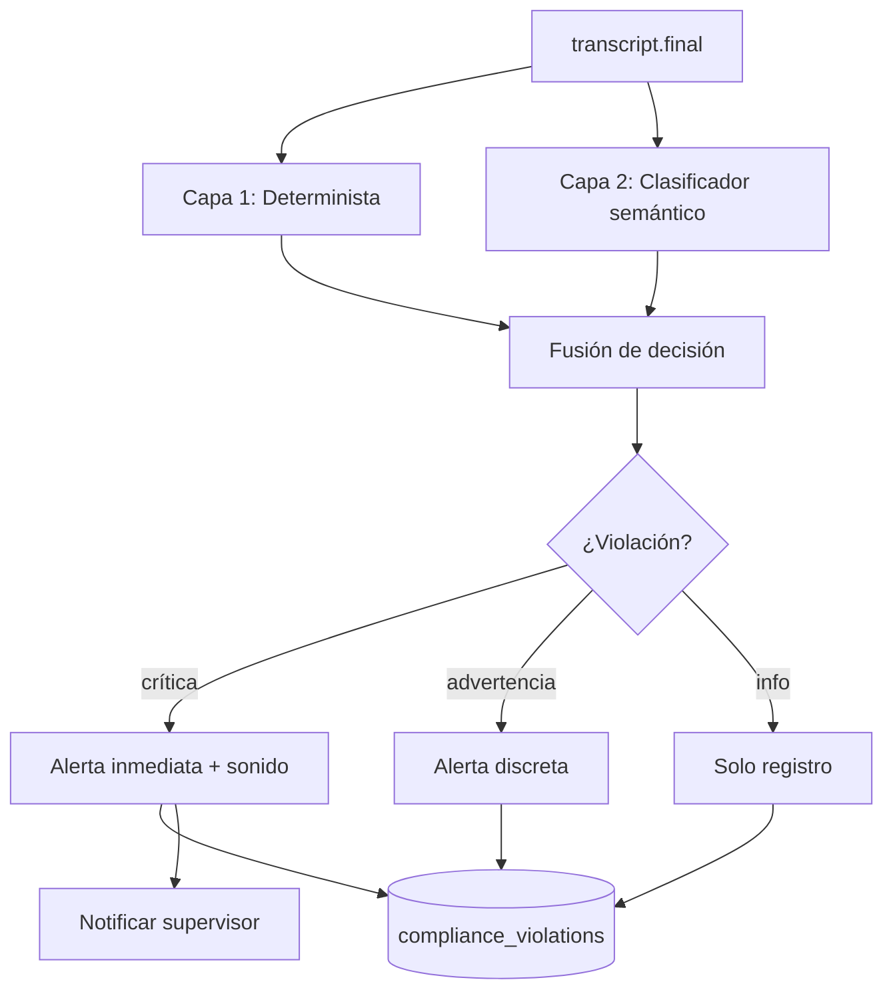

# 06 — Flujos de IA

## 1. La regla que gobierna todo el copilot

> **Si no está en el material de la empresa, el copilot no lo dice.
> Prefiere callar antes que inventar.**

Esto no es una instrucción en un prompt. Es una propiedad **estructural** del
sistema, impuesta en cuatro capas:

1. **Esquema** — `suggestions.citations` y `grounding_score` son `NOT NULL`.
   Una sugerencia sin cita no cabe en la base de datos.
2. **Recuperación** — si la mejor coincidencia está por debajo del umbral, el
   pipeline **no llama al LLM**. No hay generación sin contexto.
3. **Generación** — el modelo recibe solo los fragmentos recuperados y tiene
   prohibido usar conocimiento externo. Se le permite explícitamente
   responder `NO_ANSWER`.
4. **Verificación** — un paso posterior comprueba que cada afirmación de la
   sugerencia esté respaldada por el contexto. Si no, se descarta.

La cuarta capa es la que casi nadie implementa, y es la que convierte "casi
nunca alucina" en "no alucina".

---

## 2. Ingesta de conocimiento



### Extracción

| Formato | Herramienta | Cuidado especial |
|---|---|---|
| PDF nativo | Extracción de texto con posiciones | Preservar orden de lectura en 2 columnas |
| PDF escaneado | OCR | Los manuales viejos de call center **siempre** son escaneos |
| DOCX | Parser de XML | Conservar jerarquía de encabezados |
| HTML / URL | Extracción de contenido principal | Descartar navegación y pies |
| CSV / XLSX | Fila → registro estructurado | Catálogos de producto y precios |

### Chunking consciente de estructura

El chunking ingenuo por N caracteres destruye documentos de call center,
porque su estructura *es* el contenido. Un manual de objeciones se ve así:

```
5. OBJECIONES
   5.3 "Es muy caro"
       Respuesta primaria: ...
       Si insiste: ...
       Nunca decir: ...
```

Partir eso a la mitad convierte una respuesta útil en dos fragmentos inútiles.

**Estrategia:**
- Se respeta la jerarquía de encabezados como frontera dura
- Objetivo 400–600 tokens, máximo 900, con solapamiento de 80 tokens
- Cada chunk guarda su `heading_path` completo (`"Objeciones > Precio > Es muy caro"`)
- **Enriquecimiento contextual:** antes de embeber, se antepone a cada chunk
  una frase que lo sitúa en el documento (título, sección, tipo de documento).
  Un chunk que dice solo *"Sí, pero solo el primer mes"* es inútil aislado;
  con su contexto es recuperable.

### Versionado

Cada publicación crea `kb_version + 1`. Las llamadas guardan la versión que
usaron. **Nunca se sobrescribe conocimiento**: una llamada de marzo se audita
contra el material vigente en marzo. Esto es innegociable para compliance.

---

## 3. Copilot — flujo completo



### Detección de disparadores

**No se llama al LLM en cada frase.** Sería caro, lento, y llenaría la
pantalla del agente de ruido. Solo se dispara cuando:

| Disparador | Detección | Ejemplo |
|---|---|---|
| **Objeción** | Clasificador ligero sobre la taxonomía del tenant | "that's too expensive" |
| **Pregunta** | Patrón sintáctico + entonación ascendente | "does it work with...?" |
| **Silencio del agente** | > 3 s tras hablar el cliente | El agente se quedó en blanco |
| **Palabra clave crítica** | Lista del tenant (competidor, "cancel", "lawyer") | "I'll call my lawyer" |
| **Cambio de etapa del script** | Máquina de estados del script | Pasa a cierre |
| **Petición explícita** | El agente presiona Ctrl+Space | — |

El clasificador de disparadores debe correr en < 50 ms. Es un modelo pequeño
sobre texto, no un LLM.

### Recuperación híbrida

Ni el vectorial ni el léxico solo son suficientes:

- **Léxico (BM25)** encuentra "SKU-4471" y "descuento del 30%" — términos
  exactos que el vectorial difumina
- **Vectorial** encuentra "no me alcanza el presupuesto" cuando el manual
  dice "objeción de precio"

```
1. BM25 sobre tsv           → top 30
2. Vectorial (HNSW coseno)  → top 30
3. Fusión Reciprocal Rank   → top 20
4. Reranking cross-encoder  → top 5
5. Filtro de umbral: si score(1º) < 0.62 → NO_ANSWER
```

Filtros duros siempre aplicados: `tenant_id`, `knowledge_base_id`,
`kb_version` activa. **Ningún fragmento de otro tenant puede ser recuperado,
jamás.** El filtro va en la consulta SQL, no en el post-procesamiento.

### Generación

- **Modelo:** el más rápido con calidad suficiente. La latencia manda: 800 ms
  es el techo, y por encima de eso el agente ya siguió hablando y la
  sugerencia llega tarde — es peor que no mostrarla.
- **Streaming:** la sugerencia se emite token a token a la consola. El agente
  empieza a leer a los ~300 ms aunque termine a los 800 ms.
- **Salida estructurada:** `{ suggestion, used_chunk_ids, confidence }`.
- **Presupuesto de longitud:** máximo 45 palabras. Un agente hablando no lee
  un párrafo. Esta restricción es de diseño de producto, no técnica.
- **Idioma de la sugerencia:** en el idioma en que el agente va a hablar
  (inglés en Modo A, español en Modo B — porque en Modo B el agente habla
  español y la IA traduce).

Ese último punto es sutil y fácil de equivocar: en Modo B, mostrarle la
sugerencia en inglés al agente lo obliga a traducir mentalmente, que es
exactamente el trabajo que le quitamos.

### Verificación anti-alucinación

Paso separado, con modelo pequeño y rápido:

```
Para cada afirmación factual de la sugerencia:
   ¿está respaldada por alguno de los chunks recuperados?
   → sí: conservar
   → no: descartar la sugerencia completa y registrar el caso
```

Descartamos la sugerencia entera, no la afirmación: una sugerencia parcheada
pierde coherencia. Los descartes se registran y se revisan semanalmente — son
la señal más útil para mejorar el corpus del cliente.

### Bucle de aprendizaje

Se registra si el agente **realmente dijo** la sugerencia, comparando la
transcripción posterior contra el texto sugerido (similitud semántica). Eso da:

- Qué sugerencias se usan y cuáles se ignoran → calidad del corpus
- Correlación uso ↔ conversión → el reporte de "AI Impact" que justifica la
  renovación del contrato
- Datos para reordenar la recuperación por efectividad real, no solo por
  similitud

---

## 4. Motor de compliance



### Por qué dos capas

**La capa determinista va primero y manda.** Reglas de tipo "debe decir la
frase X antes del minuto 1" se resuelven con coincidencia de patrones: es
instantáneo, gratis, explicable y auditable. Un abogado puede leer la regla.

**El clasificador semántico es la red de seguridad**, para cuando el agente
dice lo correcto con otras palabras, o cuando promete algo prohibido de forma
creativa ("yo le garantizo que le devuelven el dinero completo").

| Tipo de regla | Capa | Ejemplo |
|---|---|---|
| `must_say` | Determinista + semántica | Grabación anunciada |
| `must_say_before` | Determinista + reloj | Verificar identidad < 60 s |
| `must_not_say` | Semántica (principal) | Prometer garantías inexistentes |
| `conditional` | Máquina de estados | Si menciona precio → debe mencionar cuotas |

### Diseño de la alerta (más importante que la detección)

Una alerta mal diseñada entrena al agente a ignorarlas, y entonces todo el
módulo vale cero.

- **Crítica** (riesgo legal): banda roja, sonido corto, requiere reconocer
- **Advertencia** (guion incompleto): texto ámbar, sin sonido
- **Info** (mejora): solo en el reporte post-llamada, nunca en vivo

**Presupuesto de ruido: máximo 3 alertas en vivo por llamada.** Si se
disparan más, se muestran las 3 de mayor severidad y el resto va al reporte.
Este límite es deliberado y no configurable hacia arriba.

Y por eso existe `POST /compliance-rules/{id}/test`: ninguna regla se activa
sin ver antes cuántas alertas habría generado en las últimas 1,000 llamadas.

---

## 5. Análisis en vivo

Corre continuamente, actualiza cada 2 s:

| Señal | Entradas | Método |
|---|---|---|
| **Sentimiento** | Texto + prosodia (tono, energía, velocidad) | Modelo multimodal ligero |
| **Estrés** | Prosodia: jitter de F0, tasa de habla, temblor | Clasificador acústico |
| **Frustración** | Sentimiento + interrupciones + repeticiones | Reglas + clasificador |
| **Interés** | Longitud de turnos, preguntas del cliente, tiempo de habla | Modelo de features |
| **Probabilidad de compra** | Todo lo anterior + etapa del script + histórico del tenant | Gradient boosting sobre features |
| **Confianza del agente** | Prosodia del agente + muletillas + pausas | Clasificador acústico |
| **Objeciones** | Texto | Clasificador sobre taxonomía del tenant |

**Nota crítica sobre la probabilidad de compra:** este modelo se entrena
**por tenant**, con sus propios resultados históricos. Un modelo genérico de
"probabilidad de cierre" es astrología. Hasta que un tenant no tenga ~2,000
llamadas con resultado conocido, el sistema muestra el valor como
*"calibrando"* en lugar de un número falso.

Prefiero mostrar "sin datos suficientes" que un 73% inventado. Un supervisor
que toma decisiones sobre un número inventado nos abandona en dos meses.

### Uso por el supervisor

El dashboard de piso ordena las llamadas activas por **riesgo**, no por
duración: combina sentimiento en caída, estrés alto, violaciones críticas y
silencio prolongado. El supervisor ve arriba las 3 llamadas que necesitan su
intervención *ahora*. Ese es el valor real del análisis en vivo — no la
gráfica bonita.

---

## 6. Pipeline post-llamada

Asíncrono, con la transcripción completa. Aquí sí usamos el modelo de mayor
calidad: no hay presión de latencia, y la calidad del resumen es lo que el
supervisor lee.

```
1. Ensamblado del contexto
   transcripción con hablantes + metadatos + script + resultado de compliance

2. Extracción estructurada (una sola pasada, salida en esquema estricto)
   summary, key_points, objections[], next_steps[], products_discussed[],
   competitors_mentioned[], suggested_disposition, suggested_tasks[]

3. Métricas conversacionales (determinista, sin LLM)
   talk_ratio, monólogo más largo, interrupciones, % de silencio

4. Adherencia al script
   qué pasos se cumplieron, en qué orden, cuáles se saltaron

5. Puntuación de QA
   rúbrica del tenant, con citas de la transcripción por cada punto

6. Escritura
   call_analysis + notes(source='ai_post_call') + tasks(source='ai_post_call')

7. Sincronización al CRM (si modo integrado)
```

**Requisito transversal:** cada elemento extraído lleva `at_ms` — el momento
exacto de la llamada de donde salió. El supervisor hace clic en "objeción de
precio" y salta al segundo 145 de la grabación. Sin esa trazabilidad, el
análisis es un texto bonito que nadie verifica y nadie confía.

---

## 7. Gestión de modelos

### Enrutamiento por perfil de latencia

| Tarea | Perfil | Criterio de selección |
|---|---|---|
| Detección de disparadores | < 50 ms | Modelo propio pequeño, on-prem |
| Clasificación de sentimiento | < 200 ms | Modelo propio, on-prem |
| Sugerencia del copilot | < 800 ms | LLM comercial rápido |
| Verificación anti-alucinación | < 200 ms | LLM pequeño |
| Análisis post-llamada | < 30 s | LLM de máxima calidad |
| Embeddings | lote | Modelo de embeddings dedicado |

### Abstracción de proveedor

Todo pasa por una capa `ModelGateway` con:
- Interfaz uniforme, con el proveedor configurable por tarea y por tenant
- **Failover automático** a un proveedor secundario ante error o timeout
- Registro de `model_version` en cada salida — sin esto, no se puede depurar
  una regresión de calidad
- Presupuesto de coste y de latencia por tarea, con alerta al superarse
- Caché de respuestas idénticas dentro de la misma llamada

**Nunca se acopla el código a un proveedor.** Los precios y la frontera de
capacidad se mueven cada trimestre; el sistema debe poder cambiar de modelo
con un cambio de configuración, no de código.

### Evaluación continua

Un set de evaluación por tenant, construido con sus propias llamadas reales:

- **Copilot:** 200 objeciones reales con la respuesta correcta del manual.
  Métrica: precisión de recuperación @5, tasa de alucinación (**objetivo: 0**),
  latencia p95.
- **Compliance:** 500 segmentos etiquetados. Métrica: recall en críticas
  (objetivo > 0.95 — un falso negativo es una multa), precisión (objetivo
  > 0.85 — un falso positivo entrena al agente a ignorar).
- **Post-llamada:** 100 llamadas con resumen escrito por un humano de QA.
  Métrica: cobertura de puntos clave, ausencia de invenciones.

**Ningún cambio de modelo, prompt o pipeline llega a producción sin pasar la
evaluación.** Se ejecuta en CI, y una regresión de alucinación bloquea el
despliegue automáticamente.
