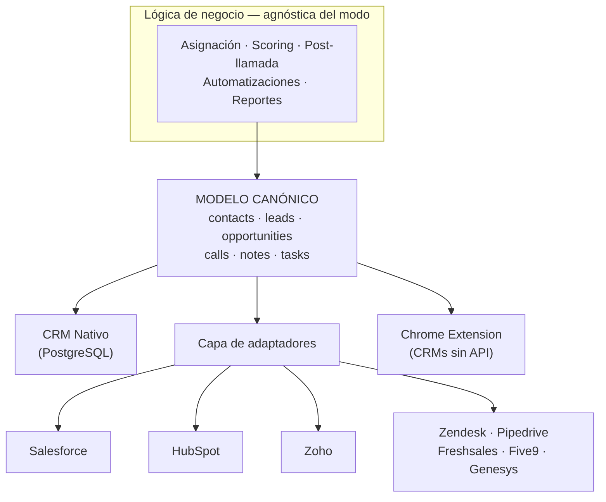
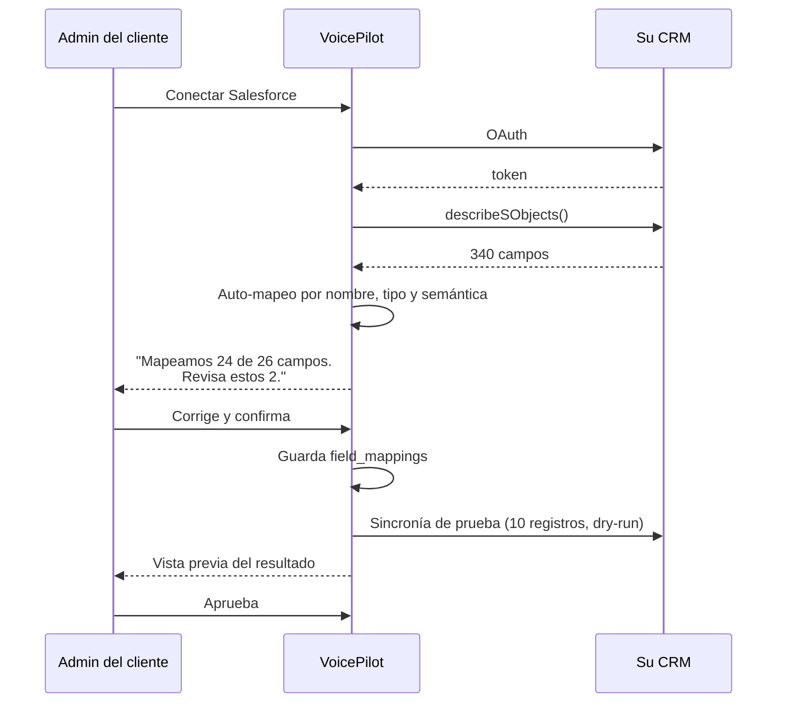

# 07 — Flujo del CRM

## 1. Una sola verdad, dos superficies

El error que hunde a los productos que "también traen CRM" es construir dos
modelos de datos: uno propio y otro para las integraciones. Terminan con dos
sistemas de reglas, dos lugares donde arreglar bugs, y features que existen
en un modo y no en el otro.

**Aquí hay un solo modelo canónico** ([doc 03](03-modelo-de-datos.md)).

- El **CRM nativo** es la implementación de referencia de ese modelo
- Los **conectores** son traductores entre ese modelo y el mundo exterior

Toda la lógica de negocio (asignación, scoring, automatizaciones, reportes,
escritura post-llamada) opera sobre el modelo canónico y **no sabe** si el
tenant está en modo nativo o integrado.



---

## 2. Los tres niveles de integración

No todos los CRMs merecen el mismo esfuerzo. Tres niveles, con criterio
explícito de cuál aplica:

| Nivel | Qué hace | Esfuerzo | Para quién |
|---|---|---|---|
| **L1 — Superposición** | La extensión de Chrome pinta VoicePilot encima. Lee el registro abierto por DOM, escribe notas en los campos del CRM. Sin API. | 1 semana por CRM | Cualquier CRM web, incluidos los caseros |
| **L2 — Escritura** | API oficial. Escribe llamadas, notas, disposiciones. Lectura bajo demanda. | 2–3 semanas | La mayoría |
| **L3 — Bidireccional** | Sincronía completa en ambos sentidos, webhooks entrantes, mapeo de campos personalizado, resolución de conflictos. | 6–8 semanas | Salesforce, HubSpot |

**Decisión para el MVP: L3 solo en HubSpot y Salesforce. L2 en Zoho y
Pipedrive. L1 para todo lo demás.**

> **[ACTUALIZADO]** El primer objetivo real es **ReadyMode**, no HubSpot: es lo
> que usa nuestro socio de diseño, y es un dialer con CRM incorporado, no un
> CRM. Eso levanta una pregunta que este documento no contemplaba —
> **¿quién es dueño de la ruta del audio?** — y que resulta ser más importante
> que toda la capa de CRM junta. Ver [doc 13](13-integracion-readymode.md).
>
> El núcleo genérico ya está construido y probado en
> [`shared/crm`](../shared/crm/): modelo canónico, contrato de adaptador con
> declaración de capacidades, motor de mapeo con dry-run, y cola de sync
> idempotente con DLQ.

Justificación: L3 en ocho CRMs es un equipo entero dedicado a mantenimiento
eterno de APIs ajenas. L1 cubre el 100% del mercado con el 5% del esfuerzo,
y es lo que hace vendible el producto desde el día uno.

---

## 3. La capa de adaptadores

Cada conector implementa una interfaz idéntica. El contrato:

```
CrmAdapter
  ├─ capabilities()              qué soporta realmente este CRM
  ├─ authenticate() / refresh()
  ├─ discoverSchema()            campos disponibles en la instancia del cliente
  ├─ pull(entity, cursor)        lectura incremental
  ├─ push(entity, payload, idempotencyKey)
  ├─ resolveByPhone(e164)        el más usado: llamada entrante → ¿quién es?
  ├─ handleWebhook(payload)      cambios entrantes
  └─ mapFields(canonical ↔ external)
```

### `capabilities()` es la pieza clave

Los CRMs no son intercambiables. Algunos no tienen objeto "Llamada". Otros no
permiten campos personalizados en la API gratuita. Otros limitan a 100
requests/día.

En lugar de fingir uniformidad y fallar en runtime, cada adaptador **declara
lo que puede hacer**, y la UI se adapta:

```json
{
  "entities": ["contact", "lead", "opportunity", "call", "note", "task"],
  "write": ["call", "note", "task", "lead.status"],
  "read": ["contact", "lead", "opportunity"],
  "webhooks": true,
  "custom_fields": true,
  "bulk": { "max_batch": 200 },
  "rate_limit": { "requests_per_day": 100000 },
  "resolve_by_phone": true
}
```

Si un CRM no soporta `opportunity`, la UI de pipeline simplemente no aparece
para ese tenant. **Nunca mostramos un botón que va a fallar.**

---

## 4. Mapeo de campos

Cada instancia de Salesforce del mundo es distinta. Un cliente llama `Status`
a lo que otro llama `Lead_Stage__c`. El mapeo debe ser configurable por
tenant, con asistencia.



Dos detalles que evitan desastres:

1. **Dry-run obligatorio.** Nunca se escribe en el CRM de producción de un
   cliente sin que un humano vea antes exactamente qué va a pasar con 10
   registros de muestra.
2. **Transformaciones declarativas**, no código:
   `{"type": "enum_map", "map": {"sale_closed": "Closed Won"}}`. Un mapeo con
   código arbitrario es un vector de ejecución en nuestro servidor.

---

## 5. Sincronía y conflictos

### Dirección por entidad (por defecto)

| Entidad | Dirección | Fuente de verdad |
|---|---|---|
| Contactos, Leads | **Pull** (CRM → VoicePilot) | El CRM del cliente |
| Oportunidades | **Pull** | El CRM del cliente |
| Llamadas | **Push** (VoicePilot → CRM) | VoicePilot |
| Transcripciones, análisis | **Push** | VoicePilot |
| Notas de IA | **Push** | VoicePilot |
| Disposición | **Push** | VoicePilot |
| Tareas | **Both** | Última escritura gana, con `updated_at` |

**Principio:** el CRM del cliente es dueño de *quién es* el contacto.
VoicePilot es dueño de *qué pasó* en la llamada. Ese reparto elimina el 90%
de los conflictos antes de que existan.

### Los conflictos que quedan

| Conflicto | Resolución |
|---|---|
| El mismo lead editado en ambos lados | Campo a campo por `updated_at`; si empatan, gana el CRM externo |
| Registro borrado en el CRM externo | Soft-delete local, se conserva el histórico de llamadas |
| Teléfono duplicado | Fusión asistida, nunca automática |
| Campo requerido faltante al escribir | Va a DLQ con motivo legible, se notifica al admin |

### Fiabilidad de la escritura

Toda escritura pasa por `sync_operations`:

- **Clave de idempotencia** derivada de `(call_id, entity, operation)` —
  reintentar nunca duplica
- Backoff exponencial con jitter, 8 intentos en 24 h
- Respeto del rate limit del proveedor, con cubeta por conexión
- Tras agotar reintentos → DLQ + `integration.sync_failed` por webhook y
  notificación en la UI
- **La cola es visible para el cliente** en la UI (`/integrations/.../operations`).
  Un cliente que ve "3 notas pendientes de sincronizar" confía más que uno al
  que todo le funciona en silencio hasta que un día no.

### Llamada entrante: resolución en < 200 ms

El caso de uso más exigente. Suena el teléfono y hay que decirle al agente
quién llama antes de que conteste:

```
1. Caché local (Redis) por teléfono E.164          → ~5 ms   (85% de aciertos)
2. Base local (contacts.phone_e164)                → ~15 ms
3. API del CRM externo (resolveByPhone)            → 150–800 ms
4. Si supera 200 ms → mostrar "desconocido" y
   rellenar la ficha cuando llegue
```

Nunca bloqueamos la pantalla del agente esperando a Salesforce. La ficha se
rellena progresivamente.

---

## 6. La extensión de Chrome (Nivel 1)

Es el caballo de Troya del producto: funciona con **cualquier** CRM web,
incluidos los caseros en PHP que no tienen API.

### Arquitectura MV3

```
┌─────────────────────────────────────────────────────────┐
│ Service Worker (background)                             │
│  · Sesión, auth, WebSocket al Realtime Hub              │
│  · Reconexión (MV3 mata el worker a los 30 s de ocio)   │
├─────────────────────────────────────────────────────────┤
│ Side Panel  ← la UI principal del copilot               │
│  · Transcripción, sugerencias, compliance, señales      │
├─────────────────────────────────────────────────────────┤
│ Content Script (por CRM)                                │
│  · Detecta qué registro está abierto                    │
│  · Lee identificadores del DOM/URL                      │
│  · Escribe notas en los campos del CRM anfitrión        │
├─────────────────────────────────────────────────────────┤
│ Offscreen Document                                      │
│  · Audio/WebRTC cuando el agente marca desde el CRM     │
└─────────────────────────────────────────────────────────┘
```

### Decisiones de diseño

**1. Side Panel, no overlay inyectado.**
Inyectar un panel flotante en el DOM ajeno rompe el layout del CRM, colisiona
con sus estilos y genera quejas. El Side Panel de Chrome vive fuera de la
página: no puede romper nada.

**2. Los selectores del DOM vienen del servidor.**
Salesforce cambia su DOM sin avisar. Si los selectores viven en el código de
la extensión, cada cambio exige una release en la Chrome Web Store con días
de revisión — mientras el producto está roto para todos.

`GET /v1/extension/config` devuelve los selectores versionados por CRM. Un
cambio de DOM se arregla en minutos, sin release.

**3. Detección en cascada.**
Para saber qué registro está abierto, en orden de fiabilidad:
```
a) Patrón de URL              (más estable)      salesforce.com/lightning/r/Lead/00Q5g.../view
b) Atributos data-* del DOM
c) Selectores CSS del servidor
d) Preguntar al agente        (último recurso, con un solo clic)
```

**4. La extensión no guarda datos de negocio.**
Solo token de sesión y preferencias de UI. Todo lo demás se pide a la API.
Una extensión comprometida no debe filtrar la base de leads.

**5. Permisos mínimos.**
`activeTab`, `sidePanel`, `storage`, y `host_permissions` **solo** de los
dominios de CRM que el tenant configuró. Nunca `<all_urls>` — es un rechazo
seguro en la revisión de la Chrome Web Store y una alerta roja para
cualquier equipo de seguridad corporativo.

### Escritura de vuelta al CRM

Al terminar la llamada, la extensión ofrece:

```
┌──────────────────────────────────────────┐
│  Llamada finalizada · 6:52               │
│                                          │
│  ✓ Resumen generado                      │
│  ✓ 2 objeciones detectadas               │
│  ✓ 1 tarea de seguimiento                │
│                                          │
│  Escribir en Salesforce:                 │
│  ☑ Nota de llamada                       │
│  ☑ Disposición → "Interested"            │
│  ☑ Tarea de seguimiento (viernes)        │
│  ☐ Mover etapa  ← requiere confirmación  │
│                                          │
│         [ Escribir ]   [ Editar ]        │
└──────────────────────────────────────────┘
```

Dos vías, según capacidades:
- **Con API disponible (L2/L3):** escribe el backend. Fiable, con reintentos.
- **Sin API (L1):** el content script rellena los campos del formulario del
  CRM y el agente pulsa guardar. Se verifica que el valor quedó escrito antes
  de marcar la operación como exitosa.

---

## 7. El CRM nativo

Para los tenants sin CRM. Alcance del MVP — deliberadamente austero:

| Módulo | MVP | Enterprise |
|---|---|---|
| **Contactos** | CRUD, importación CSV, deduplicación, timeline | Jerarquías de cuentas, enriquecimiento |
| **Leads** | CRUD, asignación, estados, scoring de IA | Reglas de asignación, round-robin ponderado |
| **Pipeline** | Kanban, etapas configurables, arrastrar y soltar | Múltiples pipelines, productos, cotizaciones |
| **Llamadas** | Historial, reproductor con transcripción sincronizada | Coaching, clips, biblioteca de mejores llamadas |
| **Notas** | Manuales + generadas por IA | Plantillas, menciones |
| **Tareas** | CRUD, vencimientos, recordatorios | Secuencias, cadencias |
| **Calendario** | Vista propia + sincronía con Google/Outlook | Reserva desde la llamada, disponibilidad de equipo |
| **Usuarios** | Invitaciones, roles, equipos | SCIM, aprovisionamiento SSO |
| **Reportes** | 8 reportes prefabricados | Constructor personalizado, programados |

### El reproductor de llamada: la pantalla que vende el producto

```
┌───────────────────────────────────────────────────────────────┐
│  ▶ ━━━━━━━━━━━━━●━━━━━━━━━━━━━━━━━━━━━━  02:25 / 06:52       │
│    Sentimiento  ▁▂▃▅▄▃▂▁▂▄▅▆▅▄▃                              │
│                     ▲ objeción: precio                        │
│                                                               │
│  ⓘ  Pista: [ Procesada (lo que el cliente oyó) ▾ ]           │
│                                                               │
│  02:21  Cliente   "that's more than I wanted to spend"        │
│  02:25  Agente    "I completely understand..."         💡     │
│                    ↳ usó la sugerencia del copilot            │
│  02:31  Cliente   "how much would it be monthly?"             │
└───────────────────────────────────────────────────────────────┘
```

Elementos no negociables:
- Transcripción sincronizada, clic para saltar
- **Selector de pista**: original del agente vs. procesada. El supervisor
  necesita ambas para coaching real (la cruda muestra al agente real; la
  procesada, lo que vivió el cliente)
- Marcadores de eventos: objeciones, alertas de compliance, sugerencias
- Indicador de qué sugerencias usó el agente

Esta es la pantalla donde el supervisor entiende, en 30 segundos, qué está
comprando. Merece más pulido que ninguna otra del producto.

---

## 8. Migración de entrada y de salida

### Entrada
Importador CSV con mapeo de columnas asistido, detección de duplicados y
dry-run. Importadores directos desde HubSpot y Salesforce para tenants que
quieran pasarse al CRM nativo.

### Salida — y lo digo en la documentación pública

Exportación completa en CSV/JSON de todos los datos: contactos, leads,
oportunidades, llamadas, transcripciones, grabaciones, análisis. Sin
formatos propietarios, sin trámite comercial, sin llamada de retención.

No es altruismo: **un cliente que sabe que puede irse, firma más rápido.**
El lock-in por rehén de datos es un modelo de negocio moribundo y una señal
de que el producto no se sostiene solo.
